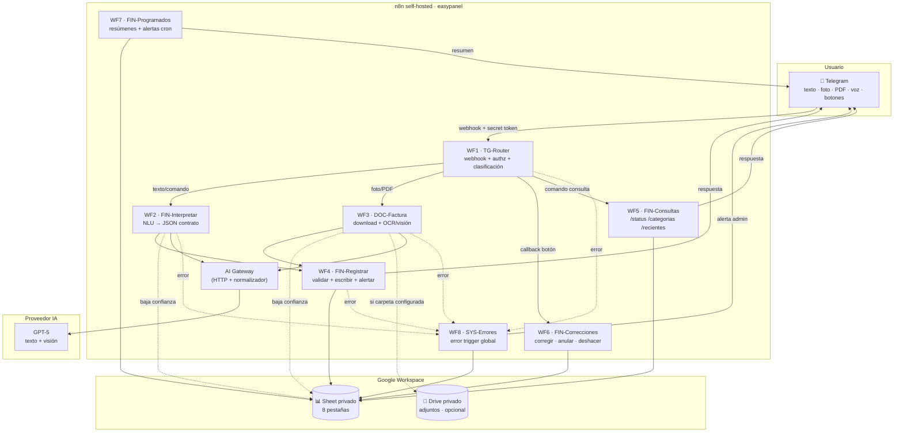
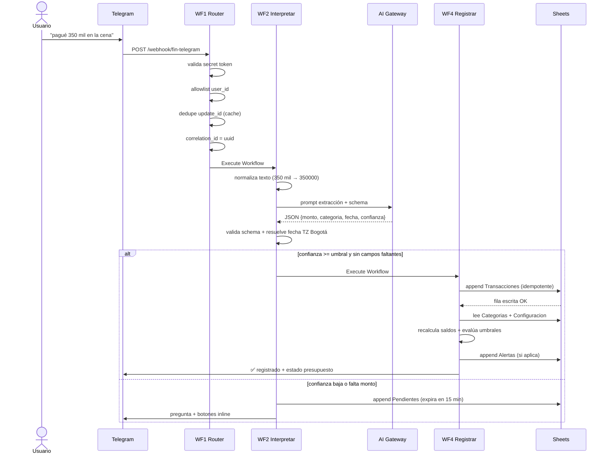
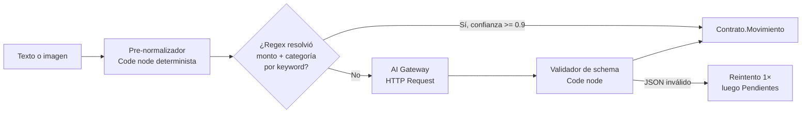
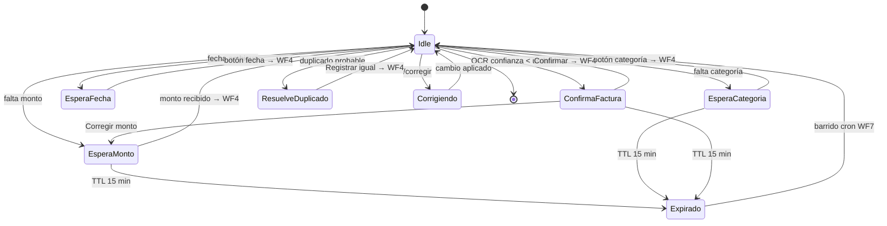

# Arquitectura — finanzas-telegram

Sistema de control de gastos personales vía Telegram, n8n self-hosted y Google Sheets.

- **Versión doc:** 1.0 (Fase 1 — diseño)
- **Fecha:** 2026-08-01
- **Zona horaria:** `America/Bogota`
- **Moneda:** COP
- **Idioma usuario:** es-CO

---

## 1. Principios de diseño

| # | Principio | Consecuencia práctica |
|---|-----------|----------------------|
| P1 | Sheets es fuente de verdad del MVP, no de la lógica | Ningún cálculo crítico depende de fórmulas de Sheets. Las fórmulas son *espejo legible*, no motor. |
| P2 | Configuración en datos, no en nodos | Categorías, umbrales, ciclos, keywords y allowlist viven en la hoja `Configuracion`/`Categorias`. Cambiarlos no requiere editar workflows. |
| P3 | Un workflow = una responsabilidad | 8 workflows, comunicados por `Execute Workflow`. Ninguno supera ~25 nodos. |
| P4 | El contenido del usuario es dato, nunca instrucción | Texto libre, OCR y facturas entran al LLM dentro de delimitadores y con salida forzada a JSON schema. Ver `docs/security.md` §6. |
| P5 | Idempotencia por diseño | Toda escritura se ancla a una clave natural (`update_id` de Telegram). Reintentos de n8n no duplican filas. |
| P6 | Nunca confirmar lo que no se escribió | El mensaje "✅ registrado" se emite *después* de verificar la escritura en Sheets. |
| P7 | Borrado lógico | Ninguna transacción se elimina físicamente. Solo cambia `estado`. |
| P8 | Proveedor de IA/OCR intercambiable | Un único subnodo `AI Gateway` (HTTP Request + Code de normalización) aísla el proveedor. Cambiar de GPT-5 a otro = editar 1 nodo + 1 credencial. |

---

## 2. Vista de componentes



---

## 3. Flujo end-to-end: gasto por texto



---

## 4. Inventario de workflows

| # | Nombre n8n | Trigger | Entradas | Salidas | Nodos aprox. |
|---|-----------|---------|----------|---------|--------------|
| 01 | `FIN — TG Router` | Webhook POST | Update de Telegram | Llama WF2/WF3/WF5/WF6 | 14 |
| 02 | `FIN — Interpretar Movimiento` | Execute Workflow Trigger | `{texto, ctx}` | `Contrato.Movimiento` → WF4 o Pendientes | 12 |
| 03 | `FIN — Procesar Factura` | Execute Workflow Trigger | `{file_id, mime, ctx}` | `Contrato.Movimiento` + confirmación | 16 |
| 04 | `FIN — Registrar Movimiento` | Execute Workflow Trigger | `Contrato.Movimiento` | Fila en Sheets + respuesta TG | 18 |
| 05 | `FIN — Consultas` | Execute Workflow Trigger | `{comando, args, ctx}` | Mensaje TG | 15 |
| 06 | `FIN — Correcciones` | Execute Workflow Trigger | `{accion, tx_id, ctx}` o callback | Sheets update + respuesta | 16 |
| 07 | `FIN — Programados` | Schedule Trigger ×3 | cron | Resúmenes + alertas TG | 14 |
| 08 | `SYS — Manejador de Errores` | Error Trigger | ejecución fallida | Auditoria + aviso admin | 8 |

Regla: WF2/WF3/WF5/WF6 **no** escriben en `Transacciones`. Solo WF4 y WF6 tocan esa hoja. Punto único de escritura = punto único de validación.

---

## 5. Contratos JSON entre workflows

Todo `Execute Workflow` transporta un sobre común:

```json
{
  "meta": {
    "correlation_id": "c8f3a1e2-...",
    "execution_id": "12345",
    "origen": "telegram_texto",
    "recibido_en": "2026-08-01T19:04:11-05:00",
    "workflow_origen": "01-telegram-router"
  },
  "ctx": {
    "telegram_user_id": 123456789,
    "telegram_chat_id": 123456789,
    "telegram_message_id": 4471,
    "update_id": 887766,
    "nombre": "Andres",
    "es_admin": true
  },
  "payload": { }
}
```

### 5.1 `Contrato.Movimiento` (salida de WF2 y WF3, entrada de WF4)

```json
{
  "intencion": "registrar_gasto",
  "tipo": "gasto",
  "monto": 350000,
  "moneda": "COP",
  "fecha_movimiento": "2026-08-01",
  "categoria_sugerida": "Restaurantes y salidas",
  "categoria_id": "CAT-004",
  "subcategoria": "Cena fuera",
  "descripcion": "Cena",
  "comercio_proveedor": null,
  "metodo_pago": null,
  "persona": null,
  "confianza": 0.94,
  "campos_faltantes": [],
  "requiere_confirmacion": false,
  "motivo_confirmacion": null,
  "evidencia": {
    "texto_original": "pagué 350 mil en la cena",
    "file_id": null,
    "hash_archivo": null,
    "datos_extraidos": {}
  }
}
```

Valores admitidos:

- `intencion`: `registrar_gasto` · `registrar_ingreso` · `registrar_reembolso` · `consultar` · `corregir` · `anular` · `ayuda` · `desconocida`
- `tipo`: `gasto` · `ingreso` · `reembolso` · `traslado` · `ajuste`
- `campos_faltantes`: subconjunto de `["monto","categoria","fecha","tipo"]`

### 5.2 `Contrato.Resultado` (salida de WF4)

```json
{
  "ok": true,
  "transaccion_id": "TX-20260801-0007",
  "escrito_en_sheets": true,
  "fila": 148,
  "posible_duplicado": false,
  "alertas_generadas": ["CAT-004@70"],
  "saldos": {
    "categoria": { "presupuesto": 800000, "gastado": 525000, "disponible": 275000, "porcentaje": 65.6 },
    "global": { "presupuesto": 4000000, "gastado": 1570000, "disponible": 2430000, "porcentaje": 39.3 },
    "ciclo": { "id": "2026-08-A", "inicio": "2026-08-01", "fin": "2026-08-15", "dias_restantes": 14 },
    "proximo_ingreso": { "nombre": "Nómina", "fecha": "2026-08-16", "dias": 15 },
    "maximo_diario_sugerido": 173571
  },
  "error": null
}
```

---

## 6. Modelo de ciclos financieros

Arquitectura soporta los tres modelos; el MVP arranca en **Modelo A** por ser el de menor ambigüedad.

| Modelo | Descripción | Estado MVP |
|--------|-------------|-----------|
| **A** | Un ciclo financiero general. Presupuestos se reinician en los días configurados en `ciclo_dias_inicio`. | ✅ Activo por defecto |
| **B** | Ciclos por fuente de ingreso; cada ingreso financia categorías específicas. | 🟡 Estructura lista (hoja `Ingresos` con `categorias_asociadas`), lógica desactivada |
| **C** | Presupuesto por mes calendario + reporte de días al próximo ingreso. | 🟡 Estructura lista, lógica desactivada |

Selector: `Configuracion → ciclo_modelo ∈ {A, B, C}`.

### 6.1 Resolución de ciclo (Modelo A)

`ciclo_dias_inicio` es una lista ordenada de días del mes, ej. `1,16`. Algoritmo (Code node `resolverCiclo`, TZ `America/Bogota`):

1. Normalizar cada día `d` contra el mes evaluado: `d_efectivo = min(d, ultimoDiaDelMes)`.
   Esto resuelve **31 en meses de 30 días** y **30/31 en febrero** sin casos especiales.
2. Construir fronteras candidatas del mes anterior, actual y siguiente.
3. `inicio_ciclo` = mayor frontera `<= fecha`. `fin_ciclo` = siguiente frontera `− 1 día`.
4. `ciclo_id` = `YYYY-MM-{A,B,C…}` según índice de la frontera dentro de su mes.
5. `dias_restantes = diffDays(fin_ciclo, hoy) + 1` (el día en curso cuenta).

Casos verificados en `tests/test-cases.md` (TC-22 a TC-25): febrero 28/29, mes de 30 días con día 31 configurado, cambio de ciclo a medianoche, gasto con fecha retroactiva que cae en ciclo cerrado.

### 6.2 Presupuesto por ciclo

Configuración confirmada (DEC-001):

| | Ciclo A | Ciclo B |
|---|---|---|
| Días | 1 → 15 | 16 → 30/31 |
| Presupuesto | $4.000.000 | $4.000.000 |
| Se financia con | el ingreso del **31 anterior** | el ingreso del **15** |

El ingreso entra el **último día del ciclo**, no el primero: se cobra el 15 y el 31 (ajustado al último día del mes cuando no hay 31). Consecuencia: `fin_ciclo` y `proxima_fecha` del ingreso pendiente **siempre coinciden**. Se reportan como dos métricas distintas porque difieren en un día — `dias_restantes_ciclo` cuenta el día en curso, `dias_proximo_ingreso` no.

- `PRESUPUESTO_CICLO_COP = 4.000.000` — presupuesto **por ciclo**, 2 ciclos/mes → $8.000.000/mes.
- El presupuesto global operativo = **suma de `presupuesto` de categorías activas** del ciclo (regla del enunciado §30). El valor de 4.000.000 se usa como *techo de control*: si la suma de categorías se aparta del techo, `/status` lo reporta como descuadre en vez de fallar en silencio.
- Un gasto con `fecha_movimiento` dentro de un ciclo ya cerrado se registra con `estado=activo`, se imputa a ese ciclo histórico y **no** altera los saldos del ciclo vigente. Se avisa al usuario.

---

## 7. Capa de IA / OCR



**Pre-normalizador determinista** (corre siempre, antes del LLM):

- `$350.000` · `350000` · `350 mil` · `350k` · `350 lucas` · `85.500 pesos` · `COP 240000` · `trescientos cincuenta mil pesos`
- Separadores colombianos: `.` = miles, `,` = decimales.
- `350 lucas` → monto correcto pero `confianza` tope 0.75 → dispara confirmación.
- Fechas relativas: hoy, ayer, antier, lunes…domingo, "el 15", "la semana pasada" → resueltas con `DateTime` de Luxon en TZ Bogotá.

Beneficio: la mayoría de mensajes de texto simples **no llaman al LLM** → menos costo y menos latencia. El LLM entra en mensajes ambiguos, multi-monto e imágenes.

**AI Gateway** — un solo nodo HTTP Request parametrizado por `AI_PROVIDER`. Cambiar proveedor no toca WF2/WF3.

---

## 8. Estado conversacional

Máquina de estados en hoja `Pendientes`, clave `telegram_chat_id`.



**Limitaciones conocidas de Sheets como store de estado:**

| Limitación | Impacto | Mitigación MVP | Migración |
|-----------|---------|----------------|-----------|
| Sin locking; dos mensajes casi simultáneos pueden leer el mismo pendiente | Baja (1–3 usuarios) | Estado se marca `consumido` con lectura-verificación antes de actuar | Redis `SETNX` |
| Latencia 300–900 ms por lectura | UX aceptable | Se lee una sola vez por interacción | Redis <5 ms |
| Sin TTL nativo | Pendientes zombis | Barrido cron cada 15 min en WF7 + chequeo de `fecha_expiracion` al leer | Redis `EXPIRE` |
| Cuota API Sheets 300 lecturas/min/proyecto | Suficiente para uso personal | — | Postgres |

Migración a Redis/Postgres: reemplazar 3 nodos (`leerPendiente`, `escribirPendiente`, `consumirPendiente`) en WF2/WF3/WF6. Los contratos JSON no cambian.

---

## 9. Idempotencia

| Riesgo | Clave de idempotencia | Mecanismo |
|--------|----------------------|-----------|
| Telegram reenvía el mismo update | `update_id` | WF1 mantiene un set de los últimos 500 `update_id` en workflow static data; duplicado → 200 OK y corta. |
| n8n reintenta WF4 tras timeout | `transaccion_id` derivado determinísticamente de `chat_id + message_id` | Antes de escribir, WF4 busca ese ID en `Transacciones`. Si existe, devuelve el resultado previo sin escribir. |
| Doble tap en botón inline | `callback_query.id` | Se responde `answerCallbackQuery` primero; el segundo tap encuentra el pendiente en estado `consumido`. |
| Cron dispara dos veces | `resumen_id = tipo + fecha` | WF7 verifica en `Alertas` si ya se envió ese resumen. |

---

## 10. Cálculos financieros

```text
gastos_validos = Σ monto WHERE estado IN ('activo','corregido_vigente')
                   AND tipo = 'gasto'
                   AND ciclo_id = ciclo_actual
reembolsos     = Σ monto WHERE tipo = 'reembolso' AND mismo filtro
gasto_neto_categoria = gastos_validos_categoria − reembolsos_categoria

disponible_categoria = presupuesto_categoria − gasto_neto_categoria
porcentaje_categoria = presupuesto = 0 ? null : gasto_neto / presupuesto × 100
disponible_global    = Σ presupuestos_activos − Σ gasto_neto
promedio_diario_sugerido = max(disponible_global, 0) / max(dias_restantes, 1)
```

Reglas de borde:

| Caso | Tratamiento |
|------|-------------|
| Reembolso | `tipo=reembolso`, resta del gasto de su categoría. **No** es ingreso. No suma a `Ingresos`. |
| Ingreso | Va a hoja `Ingresos` (`monto_recibido`, `estado=recibido`). No altera `gastado` de categorías. |
| Traslado entre cuentas | Se registra con `tipo=traslado`, excluido de todos los cálculos de presupuesto. |
| Ajuste | `tipo=ajuste`, entra a `gastos_validos` con signo. Uso: cuadres manuales. |
| Anulado | `estado=anulado` → excluido. Se recalcula el ciclo afectado. |
| Sin categoría | Va a `Otros` (`categoria_por_defecto`) y `requiere_revision=TRUE`. Genera alerta `categoria_sin_presupuesto`. |
| Presupuesto 0 | `porcentaje = null`, nunca división por cero. Alerta `categoria_sin_presupuesto`. |
| Ciclo cerrado | Movimiento se imputa al ciclo histórico; el ciclo vigente no cambia. Aviso explícito al usuario. |

`promedio_diario_sugerido` se presenta siempre como referencia aritmética, nunca como consejo financiero. Copy fijo: _"referencia matemática, no recomendación financiera"_.

---

## 11. Alertas

Umbrales por defecto (editables en `Configuracion`): 70 % · 85 % · 100 % · >100 %.

Anti-repetición: cada alerta se escribe en `Alertas` con clave `ciclo_id + categoria_id + umbral`. Antes de enviar, WF4 verifica que esa clave no exista en el ciclo vigente. Al cambiar de ciclo, las claves quedan huérfanas y los umbrales vuelven a dispararse — sin borrar histórico.

Catálogo:

| Código | Disparador | Nivel |
|--------|-----------|-------|
| `CAT_70` / `CAT_85` / `CAT_100` / `CAT_EXCEDIDO` | % de categoría | info / medio / alto / crítico |
| `GLOBAL_85` / `GLOBAL_100` | % del presupuesto global | alto / crítico |
| `RITMO_EXCESIVO` | gasto acumulado > (días transcurridos / días ciclo) × 1.3 | medio |
| `SALDO_BAJO` | disponible global < 10 % | alto |
| `INGRESO_VENCIDO` | `Ingresos.proxima_fecha` < hoy y `estado=pendiente` | medio |
| `CATEGORIA_SIN_PRESUPUESTO` | presupuesto = 0 o vacío en categoría usada | info |
| `MOVIMIENTO_INUSUAL` | monto > 3× la mediana de esa categoría en 90 días | medio |
| `POSIBLE_DUPLICADO` | ver §12 | medio |
| `DATOS_INCOMPLETOS` | `campos_faltantes` no vacío | info |
| `FALLO_OCR` | OCR sin monto legible | medio |
| `FALLO_ESCRITURA_SHEETS` | append/update falla tras reintentos | crítico → admin |

---

## 12. Detección de duplicados

Puntaje sobre ventana configurable (`tolerancia_duplicado_horas`, default 48 h):

| Señal | Puntos |
|-------|--------|
| Mismo `hash_archivo` | 100 (duplicado seguro) |
| Mismo `telegram_message_id` | 100 |
| Mismo monto exacto | 40 |
| Mismo proveedor (normalizado) | 25 |
| Misma fecha de movimiento | 20 |
| Mismo número de factura | 100 |
| Misma categoría | 10 |

- `>= 100` → duplicado confirmado, no se escribe, se avisa.
- `65–99` → duplicado probable → confirmación con botones.
- `< 65` → se registra normal.

---

## 13. Manejo de errores

`SYS — Manejador de Errores` (WF8) se configura como *Error Workflow* de los 7 restantes.

| Falla | Respuesta al usuario | Registro |
|-------|---------------------|----------|
| Telegram no entrega el archivo | "No pude descargar el archivo, reenvíalo" | `Auditoria` warn |
| Sheets caído / 5xx | "No pude guardar. Reintento automático en curso" + reintento 3× backoff (2s/8s/30s). Si falla: "**No** quedó guardado" | `Auditoria` error + alerta admin |
| Token expirado | Mensaje genérico | `Auditoria` error + alerta admin (nunca el token) |
| Cuota API excedida | "Sistema saturado, intenta en unos minutos" | `Auditoria` error |
| OCR ilegible | "No pude leer la factura. ¿Me dices el monto?" → Pendientes | `Auditoria` warn |
| JSON inválido del LLM | reintento 1× con `temperature=0`; luego Pendientes | `Auditoria` warn |
| Timeout del modelo | "Se demoró el análisis, reenvía" | `Auditoria` warn |
| Escritura parcial | Se marca `estado=incompleto`, no se confirma al usuario | `Auditoria` error + admin |
| Confirmación expirada | "Esa confirmación venció, reenvía el gasto" | `Auditoria` info |

Regla dura (P6): si `escrito_en_sheets != true`, el bot **nunca** dice que se guardó.

---

## 14. Observabilidad

Cada ejecución escribe en `Auditoria`: `correlation_id`, `execution_id`, workflow, usuario (id numérico, sin nombre ni texto libre), acción, resultado, duración ms, tokens IA consumidos, confianza de extracción, estado de entrega Telegram.

Nunca se escriben en logs: token del bot, API keys, contenido completo de facturas, ni datos personales de terceros que aparezcan en un documento.

---

## 15. Credenciales requeridas

| Credencial | Tipo n8n | Alcance | Dónde se guarda |
|-----------|----------|---------|-----------------|
| Telegram Bot (nuevo, dedicado) | `Telegram API` | Bot propio del proyecto | n8n Credentials + Bitwarden |
| Google Sheets | `Google Sheets OAuth2` o Service Account | Solo el Sheet del proyecto | n8n Credentials |
| Google Drive (opcional) | `Google Drive OAuth2` | Solo la carpeta de adjuntos | n8n Credentials |
| Proveedor IA (GPT-5) | `HTTP Header Auth` | — | n8n Credentials |
| n8n Public API | — | Solo scripts locales de import/export | Bitwarden, nunca en repo |

**Aislamiento obligatorio:** bot de Telegram, Sheet y credenciales **nuevos y exclusivos** de este proyecto. No se reutiliza nada de MSDS, Modutriplex ni AndyBot.

---

## 16. Backup y upgrade

**Backup**

- Sheet: historial de versiones de Google + copia semanal automática a Drive vía WF7 (`Google Drive → Copy file`, retención 8 copias).
- Workflows: export JSON a este repo en cada cambio (`scripts/export-workflows.js`).
- Credenciales: Bitwarden, colección propia del proyecto.
- Restauración probada: documentada en `docs/operations.md`.

**Upgrade**

- n8n: leer breaking changes → clonar los 8 workflows con sufijo `-staging` → correr `tests/` → promover.
- Cambios de esquema en Sheets: solo *añadir* columnas al final; nunca reordenar (los nodos de Sheets referencian por nombre de columna, pero los Code nodes de recálculo asumen orden en lectura por rango).
- Cambio de proveedor IA: editar `AI Gateway` + `AI_PROVIDER`. Correr TC-01…TC-12.

---

## 17. Limitaciones conocidas (MVP)

1. Sheets no soporta transacciones: un fallo entre "append transacción" y "append alerta" deja la alerta sin emitir (el movimiento sí queda). WF7 reconcilia en el siguiente barrido.
2. Concurrencia real limitada a ~3 usuarios simultáneos.
3. Notas de voz: incluidas en el diseño (Fase 4), pero se implementan solo si la transcripción alcanza precisión aceptable en español colombiano. Si no, el bot responde pidiendo texto.
4. El historial supera el rendimiento cómodo de Sheets alrededor de las ~20.000 filas de `Transacciones`. Plan: archivar por año.
5. Sin app web ni dashboard propio: el dashboard es la pestaña `Resumen`.
6. `America/Bogota` es UTC−5 fijo (Colombia no usa horario de verano). Otra zona requeriría revisar `resolverCiclo`.

---

## 18. Roadmap

| Fase | Alcance | Estado |
|------|---------|--------|
| 0 | Diagnóstico técnico | ✅ |
| 1 | Diseño: arquitectura, modelo de datos, contratos, seguridad, plan de pruebas | 🔄 en curso |
| 2 | Infra base: repo, Sheet, datos demo, credenciales | ⬜ |
| 3 | Flujo de texto end-to-end (WF1, WF2, WF4, WF8) | ⬜ |
| 4 | Facturas: imagen, PDF, OCR, confirmación (WF3) | ⬜ |
| 5 | Consultas y correcciones (WF5, WF6) | ⬜ |
| 6 | Alertas y resúmenes programados (WF7) | ⬜ |
| 7 | Endurecimiento: seguridad, idempotencia, observabilidad, pruebas | ⬜ |
| 8+ | Post-MVP: Redis para estado, dashboard Looker Studio, multi-moneda, exportación contable | ⬜ |
