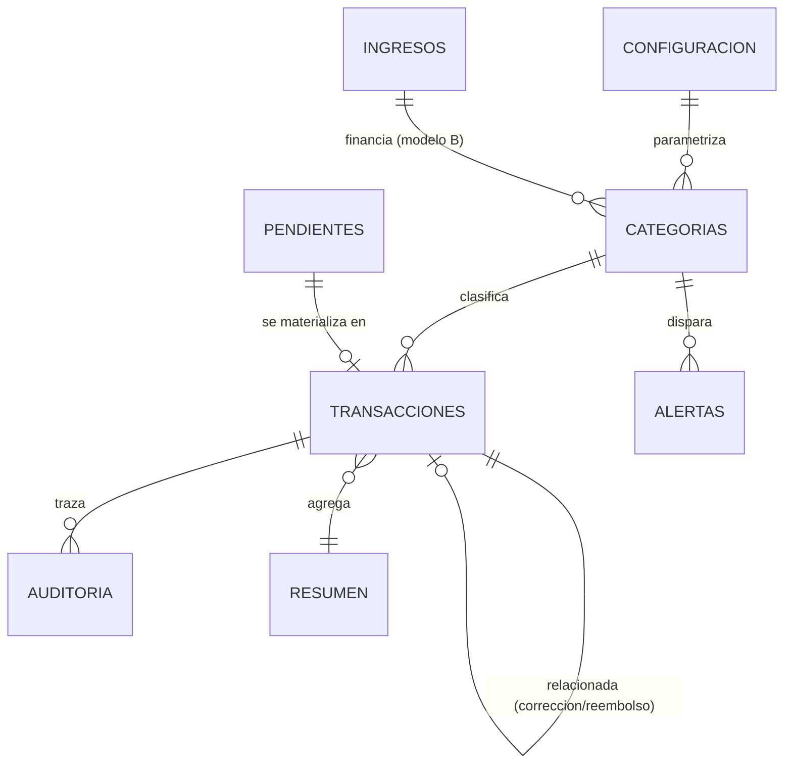

# Modelo de datos — finanzas-telegram

Fuente de verdad del MVP: **un** Google Sheet privado con 8 pestañas.
Convención: nombres de hoja y de columna en español sin tildes ni espacios (evita romper referencias A1 y expresiones n8n).

Tipos: `TEXTO` · `NUMERO` · `MONEDA_COP` · `FECHA` (`YYYY-MM-DD`) · `TIMESTAMP` (ISO 8601 con offset `-05:00`) · `BOOL` (`TRUE`/`FALSE`) · `ENUM` · `JSON` (string serializado).

Fila 1 = encabezados. Fila 2 en adelante = datos. Ninguna hoja lleva filas de título por encima del encabezado.

---

## 1. `Configuracion`

Clave/valor. Es el panel de control del sistema: cambiar aquí no requiere tocar workflows.

| Columna | Tipo | Notas |
|---------|------|-------|
| `clave` | TEXTO | snake_case, única. **PK** |
| `valor` | TEXTO | siempre string; el consumidor castea según `tipo_dato` |
| `descripcion` | TEXTO | para el humano |
| `tipo_dato` | ENUM | `texto` · `numero` · `bool` · `lista` · `hora` · `enum` |
| `estado` | ENUM | `activo` · `inactivo` |

### Valores iniciales

| clave | valor | tipo_dato | descripción |
|-------|-------|-----------|-------------|
| `moneda` | `COP` | texto | Moneda base |
| `zona_horaria` | `America/Bogota` | texto | TZ para toda resolución de fechas |
| `idioma` | `es-CO` | texto | Idioma de las respuestas |
| `autorizados_user_ids` | *(pendiente AP)* | lista | user_id numéricos separados por coma. Vacío = bot bloqueado para todos |
| `admin_chat_id` | *(pendiente AP)* | texto | Destino de alertas técnicas |
| `umbral_aviso_1` | `70` | numero | % aviso preventivo |
| `umbral_aviso_2` | `85` | numero | % aviso alto |
| `umbral_critico` | `100` | numero | % presupuesto consumido |
| `confirmacion_activa` | `TRUE` | bool | Pedir confirmación en casos ambiguos |
| `resumen_diario_activo` | `FALSE` | bool | Resumen diario |
| `resumen_semanal_activo` | `TRUE` | bool | Resumen semanal |
| `hora_envio_resumen` | `20:00` | hora | Hora local de envío |
| `dia_resumen_semanal` | `0` | numero | 0 = domingo |
| `ciclo_modelo` | `A` | enum | `A` · `B` · `C` (ver architecture.md §6) |
| `ciclo_dias_inicio` | `1,16` | lista | Días de arranque de ciclo. `31` se ajusta solo al último día del mes |
| `presupuesto_ciclo_techo` | `4000000` | numero | Techo de control por ciclo. El presupuesto operativo = suma de categorías activas |
| `tolerancia_duplicado_horas` | `48` | numero | Ventana de detección de duplicados |
| `categoria_por_defecto` | `CAT-015` | texto | `Otros` |
| `confianza_minima_ia` | `0.80` | numero | Bajo este valor → confirmación obligatoria |
| `ttl_pendientes_minutos` | `15` | numero | Expiración de interacciones pendientes |
| `max_archivo_mb` | `10` | numero | Límite de tamaño de adjunto |
| `guardar_adjuntos_drive` | `FALSE` | bool | Si `TRUE`, requiere `GOOGLE_DRIVE_FOLDER_ID` |
| `factor_ritmo_excesivo` | `1.3` | numero | Multiplicador para alerta de ritmo |
| `umbral_movimiento_inusual` | `3` | numero | Veces la mediana de la categoría |

---

## 2. `Categorias`

| Columna | Tipo | Notas |
|---------|------|-------|
| `categoria_id` | TEXTO | `CAT-###`. **PK**, inmutable |
| `nombre` | TEXTO | Visible al usuario. Único entre activas |
| `descripcion` | TEXTO | |
| `grupo` | ENUM | `Esencial` · `Variable` · `Discrecional` · `Financiero` |
| `presupuesto` | MONEDA_COP | Por ciclo. `0` = sin presupuesto (dispara alerta al usarse) |
| `ciclo` | ENUM | `ciclo` · `mensual`. Con `ciclo_modelo=A` se usa `ciclo` |
| `fecha_inicio` | FECHA | Inicio del ciclo vigente. **Calculado**, no editar a mano |
| `fecha_fin` | FECHA | Fin del ciclo vigente. **Calculado** |
| `gastado` | MONEDA_COP | **Calculado** por WF4/WF7. Neto de reembolsos |
| `disponible` | MONEDA_COP | **Calculado** = `presupuesto − gastado` |
| `porcentaje_usado` | NUMERO | **Calculado**. Vacío si `presupuesto = 0` |
| `estado` | ENUM | **Calculado**: `ok` · `aviso` · `alto` · `limite` · `excedido` · `sin_presupuesto` |
| `activa` | BOOL | `FALSE` la excluye del presupuesto global sin borrar histórico |
| `palabras_clave` | TEXTO | Separadas por `|`. Alimentan el clasificador determinista |
| `notas` | TEXTO | |

### Catálogo inicial

| categoria_id | nombre | grupo | palabras_clave (ejemplos) |
|---|---|---|---|
| CAT-001 | Vivienda | Esencial | arriendo\|administracion\|hipoteca |
| CAT-002 | Servicios publicos | Esencial | electrohuila\|agua\|gas\|luz\|internet\|energia |
| CAT-003 | Mercado | Esencial | mercado\|supermercado\|d1\|ara\|exito\|olimpica\|jumbo |
| CAT-004 | Restaurantes y salidas | Discrecional | cena\|almuerzo\|restaurante\|domicilio\|rappi\|cafe |
| CAT-005 | Transporte | Variable | gasolina\|terpel\|taxi\|uber\|didi\|peaje\|bus\|combustible |
| CAT-006 | Salud | Esencial | eps\|medicamento\|droguería\|cruz verde\|farmacia\|consulta |
| CAT-007 | Mascotas | Variable | veterinario\|concentrado\|guarderia canina |
| CAT-008 | Suscripciones | Discrecional | netflix\|spotify\|disney\|icloud\|chatgpt\|plan celular |
| CAT-009 | Educacion | Esencial | matricula\|curso\|colegio\|universidad\|libros |
| CAT-010 | Deudas | Financiero | cuota\|tarjeta de credito\|prestamo\|credito |
| CAT-011 | Compras personales | Discrecional | ropa\|zapatos\|tecnologia\|regalo |
| CAT-012 | Hogar | Variable | aseo\|ferreteria\|muebles\|reparacion |
| CAT-013 | Viajes | Discrecional | vuelo\|hotel\|avianca\|tiquete\|hospedaje |
| CAT-014 | Imprevistos | Variable | imprevisto\|emergencia\|multa |
| CAT-015 | Otros | Variable | *(vacío — categoría por defecto)* |

Los montos de presupuesto se entregan como **datos de demostración** en `sheets/demo-data.csv`, marcados `DEMO`. AP los reemplaza con sus cifras reales antes de operar.

---

## 3. `Transacciones`

Hoja append-only. Las correcciones no sobrescriben montos: cambian `estado` y crean una fila nueva enlazada.

| Columna | Tipo | Notas |
|---------|------|-------|
| `transaccion_id` | TEXTO | `TX-YYYYMMDD-NNNN`. **PK**. Determinístico desde `chat_id+message_id` para idempotencia |
| `timestamp_registro` | TIMESTAMP | Cuándo se guardó |
| `fecha_movimiento` | FECHA | Cuándo ocurrió el gasto (puede ser retroactiva) |
| `ciclo_id` | TEXTO | `YYYY-MM-A`/`-B`. **Calculado** desde `fecha_movimiento` |
| `tipo` | ENUM | `gasto` · `ingreso` · `reembolso` · `traslado` · `ajuste` |
| `monto` | MONEDA_COP | Siempre positivo. El signo lo determina `tipo` |
| `moneda` | TEXTO | `COP` |
| `categoria_id` | TEXTO | FK → `Categorias.categoria_id` |
| `categoria` | TEXTO | Denormalizado para lectura humana |
| `subcategoria` | TEXTO | Libre |
| `descripcion` | TEXTO | Texto corto normalizado |
| `comercio_proveedor` | TEXTO | Normalizado en minúsculas sin tildes para matching |
| `metodo_pago` | ENUM | `efectivo` · `debito` · `credito` · `transferencia` · `nequi` · `daviplata` · `no_especificado` |
| `persona` | TEXTO | A quién corresponde el gasto |
| `origen` | ENUM | `telegram_texto` · `telegram_imagen` · `telegram_pdf` · `telegram_audio` · `manual` · `automatizacion` |
| `telegram_user_id` | NUMERO | |
| `telegram_chat_id` | NUMERO | |
| `telegram_message_id` | NUMERO | |
| `file_id` | TEXTO | `file_id` de Telegram. Caduca; no es almacenamiento permanente |
| `archivo_url_o_referencia` | TEXTO | URL de Drive solo si `guardar_adjuntos_drive=TRUE` |
| `hash_archivo` | TEXTO | SHA-256 del binario. Señal fuerte de duplicado |
| `texto_original` | TEXTO | Mensaje del usuario tal cual. **Nunca** se reinyecta como instrucción al LLM |
| `datos_extraidos` | JSON | Salida cruda del extractor, truncada a 2.000 chars |
| `confianza_ia` | NUMERO | 0.00–1.00 |
| `requiere_revision` | BOOL | |
| `estado` | ENUM | `activo` · `corregido` · `anulado` · `eliminado` · `incompleto` |
| `posible_duplicado` | BOOL | |
| `transaccion_relacionada` | TEXTO | FK → `transaccion_id`. Enlaza corrección↔original, reembolso↔gasto |
| `correlation_id` | TEXTO | Traza cruzada con `Auditoria` |
| `notas` | TEXTO | |

**Semántica de `estado`:**

- `activo` — cuenta para los cálculos.
- `corregido` — versión antigua reemplazada por otra fila. **No** cuenta.
- `anulado` — revertido por el usuario (`/anular`). No cuenta. Se conserva.
- `eliminado` — borrado lógico administrativo. No cuenta.
- `incompleto` — escritura parcial detectada. No cuenta. Requiere revisión manual.

Solo `activo` entra en `gastos_validos`.

---

## 4. `Ingresos`

| Columna | Tipo | Notas |
|---------|------|-------|
| `ingreso_id` | TEXTO | `ING-###`. **PK** |
| `nombre` | TEXTO | Ej. "Nómina quincena" |
| `monto_esperado` | MONEDA_COP | |
| `monto_recibido` | MONEDA_COP | Vacío hasta confirmarse |
| `frecuencia` | ENUM | `mensual` · `quincenal` · `semanal` · `unico` · `variable` |
| `dia_programado` | NUMERO | 1–31. `31` se ajusta al último día del mes |
| `proxima_fecha` | FECHA | **Calculada** por WF7 |
| `fecha_recibido` | FECHA | |
| `estado` | ENUM | `recibido` · `pendiente` · `vencido` |
| `categorias_asociadas` | TEXTO | IDs separados por `|`. Solo se usa con `ciclo_modelo=B` |
| `notas` | TEXTO | |

---

## 5. `Resumen`

Panel de lectura. Se escribe por workflow (no depende de fórmulas frágiles); las fórmulas de `sheets/formulas.md` son verificación cruzada opcional.

| Columna | Tipo |
|---------|------|
| `metrica` | TEXTO (**PK**) |
| `valor` | TEXTO / MONEDA_COP |
| `unidad` | TEXTO |
| `ciclo_id` | TEXTO |
| `actualizado_en` | TIMESTAMP |

Métricas: `presupuesto_total`, `gastado_total`, `disponible_total`, `porcentaje_consumido`, `gasto_hoy`, `gasto_semana`, `gasto_ciclo`, `dias_restantes_ciclo`, `proximo_ingreso_nombre`, `proximo_ingreso_fecha`, `dias_proximo_ingreso`, `promedio_diario_disponible`, `maximo_diario_sugerido`, `categorias_en_aviso`, `categorias_excedidas`, `tendencia_vs_ciclo_anterior`, `transacciones_ciclo`, `pendientes_abiertos`.

---

## 6. `Alertas`

| Columna | Tipo | Notas |
|---------|------|-------|
| `alerta_id` | TEXTO | `AL-YYYYMMDD-NNNN`. **PK** |
| `timestamp` | TIMESTAMP | |
| `clave_dedupe` | TEXTO | `ciclo_id\|categoria_id\|codigo`. **Única por ciclo** — evita repetir alertas |
| `tipo` | TEXTO | Código del catálogo (architecture.md §11) |
| `nivel` | ENUM | `info` · `medio` · `alto` · `critico` |
| `categoria` | TEXTO | |
| `valor_actual` | NUMERO | |
| `limite` | NUMERO | |
| `mensaje` | TEXTO | Texto enviado |
| `enviada` | BOOL | |
| `telegram_message_id` | NUMERO | |
| `resuelta` | BOOL | |
| `fecha_resolucion` | TIMESTAMP | |

---

## 7. `Pendientes`

| Columna | Tipo | Notas |
|---------|------|-------|
| `pendiente_id` | TEXTO | `PE-YYYYMMDD-NNNN`. **PK** |
| `telegram_chat_id` | NUMERO | Clave de búsqueda |
| `telegram_message_id` | NUMERO | Mensaje del bot con los botones |
| `estado_maquina` | ENUM | `espera_monto` · `espera_categoria` · `espera_fecha` · `confirma_factura` · `resuelve_duplicado` · `corrigiendo` |
| `datos_propuestos` | JSON | `Contrato.Movimiento` parcial |
| `campo_ambiguo` | TEXTO | |
| `opciones` | JSON | Opciones ofrecidas en botones |
| `fecha_creacion` | TIMESTAMP | |
| `fecha_expiracion` | TIMESTAMP | `fecha_creacion + ttl_pendientes_minutos` |
| `estado` | ENUM | `abierto` · `consumido` · `expirado` · `cancelado` |
| `correlation_id` | TEXTO | |

Solo puede existir **un** pendiente `abierto` por `telegram_chat_id`. Uno nuevo cancela el anterior (`estado=cancelado`) e informa al usuario.

---

## 8. `Auditoria`

| Columna | Tipo | Notas |
|---------|------|-------|
| `evento_id` | TEXTO | `EV-YYYYMMDD-NNNN`. **PK** |
| `timestamp` | TIMESTAMP | |
| `correlation_id` | TEXTO | |
| `workflow` | TEXTO | Ej. `04-registrar-movimiento` |
| `ejecucion` | TEXTO | `execution_id` de n8n |
| `usuario` | NUMERO | Solo `telegram_user_id`. **Nunca** nombre ni texto libre |
| `accion` | TEXTO | `autorizar` · `interpretar` · `ocr` · `escribir_transaccion` · `alertar` · `corregir` · `anular` · `consultar` · `resumen` |
| `resultado` | ENUM | `ok` · `warn` · `error` |
| `detalle` | TEXTO | Sin PII ni secretos |
| `error` | TEXTO | Mensaje saneado |
| `datos_tecnicos` | JSON | duración ms, tokens IA, confianza, reintentos |

---

## 9. Relaciones

---

## 10. Reglas de integridad

1. `transaccion_id` es determinístico: `TX-{YYYYMMDD}-{hash6(chat_id + message_id)}`. Reintento de n8n → mismo ID → no duplica.
2. `categoria_id` en `Transacciones` siempre existe en `Categorias`. Si el clasificador no resuelve, se usa `categoria_por_defecto`.
3. `monto` siempre `> 0`. Un movimiento con monto `0` o negativo se rechaza y pide confirmación.
4. `fecha_movimiento` no puede ser futura más de 1 día ni anterior a 24 meses. Fuera de rango → confirmación.
5. `Categorias.gastado` es derivado. Editarlo a mano se pierde en el siguiente recálculo.
6. Cambiar `presupuesto` de una categoría afecta solo el ciclo vigente en adelante; los ciclos cerrados conservan su historia en `Alertas` y `Resumen`.
7. Toda escritura en `Transacciones` genera exactamente un evento en `Auditoria`.

---

## 11. Retención y archivado

| Hoja | Retención | Acción al vencer |
|------|-----------|------------------|
| `Transacciones` | Indefinida hasta ~20.000 filas | Archivar año cerrado a hoja `Transacciones_YYYY` |
| `Alertas` | 12 meses | Purga por WF7 |
| `Pendientes` | 7 días | Purga por WF7 |
| `Auditoria` | 90 días | Purga por WF7 |
| `Resumen` | Solo ciclo vigente | Se sobrescribe |
