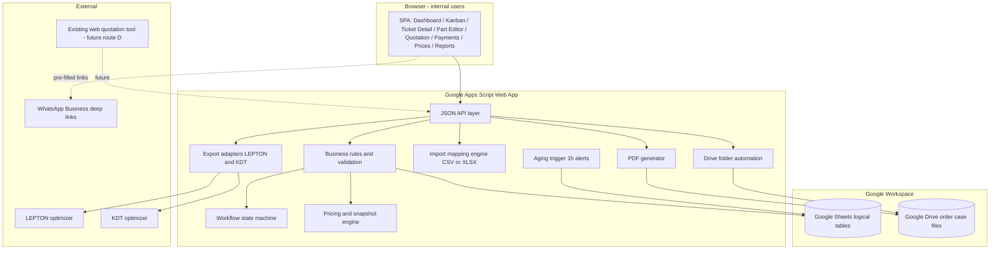
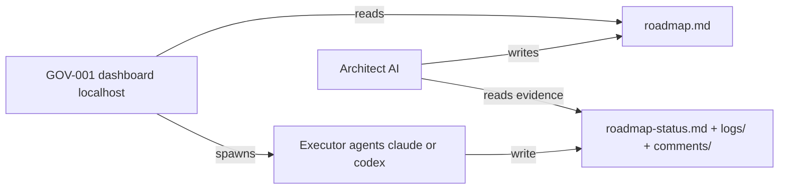

# Architecture — Wood-Panel Cutting & Edge-Banding Order Platform ("Panel-Ops")

**Version:** 1.0 · **Owner:** Architect AI · **Date:** 2026-07-17
**Status:** Approved baseline for Phase 0–3 execution. Changes require an ADR.

---

## 1. Architecture Summary

Internal browser-based operational platform for a Colombian wood-panel SME (3 users).
Single source of truth per customer order: intake → review → normalization → confirmation →
quotation → approval → payment verification → production handoff → delivery → closure.

MVP stack (Decision D-01, see ADR-001):

- **Frontend:** HTML + CSS + vanilla JavaScript, served by Apps Script Web App.
- **Backend:** Google Apps Script (Web App, `doGet`/`doPost` JSON API).
- **Data layer:** Google Sheets as logical tables with stable UUID-style IDs.
- **Documents:** Google Drive structured folders per order.
- **Identity:** Google Workspace accounts; role table in Sheets.
- **Automation:** Apps Script time-driven triggers (aging alerts); n8n later.
- **Messaging:** WhatsApp deep links with pre-filled templates; official API later.
- **Exports:** canonical part model + independent LEPTON / KDT adapters.

Design constraint: every schema, ID, and contract must survive a future migration to
PostgreSQL/Supabase without data rewrite (migration triggers in §8).

## 2. Component Diagram

Governance plane (separate from the product):

## 3. Bounded Contexts / Modules

| Context | Responsibility | Key tables |
|---|---|---|
| **Intake** | Ticket creation, channel capture, immutable original source | Tickets, Imports, Documents |
| **Customer** | Customer master data | Customers |
| **Parts** | Canonical part schema, validation, editor, import mapping | Parts, Imports |
| **Workflow** | State machine, transitions, ownership, aging, labels | Tickets, Workflow_States, Activity |
| **Pricing** | Price tables, effective dating, snapshots | Panel_Prices, Cut_Prices, Edge_Banding_Prices, Configuration |
| **Quotation** | Quotation versions, lines, PDF, 48h validity | Quotations, Quotation_Lines |
| **Payments** | Registration, evidence, verification, commercial lock | Payments |
| **Documents** | Drive case file, naming convention, links | Documents |
| **Production Handoff** | Technical package, optimizer exports (price-free) | Parts, Documents |
| **Reporting** | KPIs, conversion, times, loss reasons | Activity + all |
| **Governance** | roadmap, dashboard, executor evidence (not part of product) | filesystem artifacts |

Cross-context rule: contexts communicate only through table contracts defined in
`data-model.md`. No module reads another module's internals.

## 4. Integration Boundaries

| Boundary | Contract | Direction | Status |
|---|---|---|---|
| LEPTON | CSV/XLSX file, layout TBD (DIS-001) | export only | **blocked on real sample** |
| KDT Optimizer | CSV/XLSX file, layout TBD (DIS-001) | export only | **blocked on real sample** |
| WhatsApp (phase 1) | `wa.me` deep link + URL-encoded template text | outbound, human sends | designable now |
| WhatsApp API (future) | official Business API | bidirectional | out of MVP |
| Existing quotation tool | Route D, contract TBD (DIS-002) | inbound | discovery |
| Bank email parsing | n8n, future | inbound | out of MVP |

Core platform never depends on external file layouts — adapters only
(`integration-contracts.md`).

## 5. Document Repository Structure

As specified in master doc §12 (root `/WOOD_PANEL_OPERATIONS`, per-order folders
`00_ORIGINAL_REQUEST` … `07_CLOSURE`, naming `ORD-YYYYMM-NNNN_*`). The Drive automation
module is the only writer of folder structure. Original request files: write-once —
the app never overwrites or deletes anything in `00_ORIGINAL_REQUEST`.

## 6. Security & Data-Integrity Invariants

1. Access restricted to company Google Workspace accounts; role resolved server-side from `Users` table on every request. Client-side role checks are cosmetic only.
2. Original request artifacts immutable (write-once folder + Documents row flagged `immutable=true`).
3. All dimensions stored in millimetres; conversion at intake, never at read time.
4. Every quotation version stores a full price snapshot (denormalized into Quotation_Lines).
5. Paid order → commercial snapshot frozen; server rejects edits to Parts/Quotation of a paid ticket except through the authorized exception flow (management approval recorded in Activity).
6. Only role `billing` can set payment state to `confirmed`.
7. No transition to `Ready for production` without `Payment confirmed` (state machine enforced server-side).
8. Production exports must contain zero commercial fields — export adapters whitelist technical columns, never blacklist.
9. Every state change appends an Activity row: timestamp, user, from-state, to-state, note. Activity is append-only.
10. IDs are generated server-side, opaque, and stable (`CUS-`, `ORD-`, `PRT-`, `QUO-`, `PAY-` prefixes + sequence); never reused.
11. Sheets rows are never physically deleted — `status=inactive`/`deleted_at` soft-delete only.
12. AI agents (future) produce drafts only; cannot confirm prices, payments, or ambiguous dimensions.
13. Governance: `roadmap.md` read-only for executors and dashboard; runtime truth lives in `roadmap-status.md`.

## 7. Non-Functional Requirements

- 3 concurrent users, ~10–50 tickets/day assumed (unvalidated — DIS-003).
- Page interactions < 3 s perceived (Apps Script cold starts mitigated by single-page UI + batched reads).
- All writes go through a single Apps Script lock (`LockService`) to protect Sheets from concurrent corruption.
- Spanish UI text; English code identifiers and docs.

## 8. Migration Triggers (to PostgreSQL/Supabase)

>10 active users · >~20k tickets · multi-branch · automated banking · audit demands ·
multi-tenant productization. Schema in `data-model.md` is written relationally to make
this a data-copy, not a redesign.

## 9. Architecture Deliverables Index

- `architecture.md` (this file)
- `data-model.md`
- `workflow-state-machine.md`
- `permissions-matrix.md`
- `integration-contracts.md`
- `risk-register.md`
- `acceptance-strategy.md`
- `roadmap.md`
- `docs/adr/ADR-001-google-workspace-stack.md`
- `docs/adr/ADR-002-sheets-as-relational-store.md`
- `docs/adr/ADR-003-execution-governance.md`
