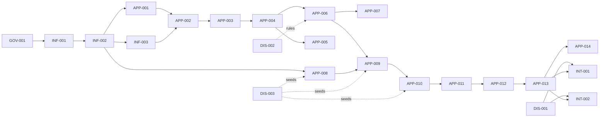

# Roadmap — Panel-Ops
**Owner:** Architect AI. This file is the authoritative execution plan.
**Read-only for executors and the dashboard.** Runtime status lives in `roadmap-status.md`.
Baseline statuses here are descriptive only.

Executor rules (binding for every ticket): read `comments/<TICKET>.jsonl` first, human
comments are binding; implement only the assigned ticket; respect invariants; run
verification; update `roadmap-status.md`; append completion/blockage comment; never edit
`roadmap.md`; never touch files outside "Files allowed to change".

Global invariants (apply to every APP/INF/INT ticket): server-side role enforcement;
soft deletes only; append-only Activity; all writes via LockService path; no credentials
in code; Spanish UI text, English identifiers; schemas exactly per `data-model.md`.

Phases: 0 Discovery · 1 Governance + Operational Control · 2 Parts + Quotation ·
3 Approval + Payment · 4 Optimizer Exports · 5 AI (not yet ticketed).

---

## Phase 0 — Discovery (human tasks, tracked as tickets)

## DIS-001 — Optimizer Format Samples

- Status baseline: pending
- Recommended model: human (Management/Advisor) — not an agent task
- Dependencies: none
- Objective: Obtain real import files accepted by LEPTON and KDT Optimizer plus full format specs.
- Context: `integration-contracts.md §1–2`. INT-001/INT-002 are hard-blocked on this.
- Scope: real LEPTON file; real KDT file; exact columns and order; units; decimal separator; delimiter; encoding; grain/rotation rules; material/thickness encoding; edge-band encoding; required vs optional columns.
- Out of scope: building adapters.
- Architectural invariants: executors must never invent these formats.
- Files allowed to change: `discovery/optimizers/` (new samples + notes)
- Deliverables: sample files + `discovery/optimizers/format-notes.md`
- Verification commands: n/a (human)
- Acceptance criteria: both files verified accepted by the real software; every format question in `integration-contracts.md` answered in writing.
- Rollback notes: n/a
- Architect notes: photograph/screenshot software import screens if docs unavailable.

## DIS-002 — Existing Web Quotation Tool Discovery

- Status baseline: pending
- Recommended model: human + claude-haiku-4-5-20251001 (summarization only)
- Dependencies: none
- Objective: Document the current quotation tool: capabilities, restrictions (min part size, face orientation), data outputs, integration options.
- Context: Route D intake; its validation rules must fold into the canonical validation layer, not be duplicated.
- Scope: screenshots or technical access; list of operational restrictions; export formats it produces.
- Out of scope: integration implementation.
- Architectural invariants: none beyond documentation accuracy.
- Files allowed to change: `discovery/quotation-tool/`
- Deliverables: `discovery/quotation-tool/notes.md`
- Verification commands: n/a
- Acceptance criteria: restriction list complete enough to specify canonical validation rules; integration feasibility stated.
- Rollback notes: n/a
- Architect notes: unblocks future Route D ticket; not blocking Phases 1–3.

## DIS-003 — Commercial Inputs Package

- Status baseline: pending
- Recommended model: human (Management + accountant)
- Dependencies: none
- Objective: Collect real commercial inputs: current price tables (panels, cuts by thickness, edge tape/application), customer-supplied-material surcharge rule, current quotation sample, panel-reference catalog, tape types/sizes, transport rules, accountant-validated VAT + withholding treatment, logo + legal company data, delivery terms, avg tickets/day and parts/ticket.
- Context: master doc §24. Pricing engine (APP-009) configurable but needs real seeds; PDF (APP-010) needs branding/legal.
- Scope: data collection only.
- Out of scope: entering data into the system (done via APP-008 UI later).
- Architectural invariants: never hard-code tax rules; withholding stays configurable until accountant signs off.
- Files allowed to change: `discovery/commercial/`
- Deliverables: price spreadsheets, quotation sample, catalog list, tax memo, branding assets.
- Verification commands: n/a
- Acceptance criteria: APP-008/009/010 can be seeded without inventing any value.
- Rollback notes: n/a
- Architect notes: partial delivery acceptable; missing items become explicit blockers on dependent tickets.

---

## Phase 1 — Governance + Operational Control

## GOV-001 — Local Roadmap Execution Dashboard

- Status baseline: pending
- Recommended model: claude-opus-4-8
- Dependencies: none
- Objective: Localhost-only dashboard that reads this `roadmap.md`, shows Kanban of tickets (To Do / In Progress / Blocked / Completed), safely launches approved executor agents, and writes all runtime evidence outside the roadmap.
- Context: ADR-003. Full normative spec: `roadmap_dashboard_execution_ticket_en.md` + master doc §27 (both binding).
- Scope: exactly two source files `tools/roadmap-dashboard/server.mjs` and `tools/roadmap-dashboard/index.html`; runtime artifacts `roadmap-status.md`, `logs/`, `comments/`. Cards show ID, title, short description, dependencies + their completion, recommended model, runtime state. Execute button validates: ticket pending, no active run for ticket, dependencies complete (from ledger, not roadmap text), model/runner allowlisted, ticket still exists in roadmap. Claude runner: `claude --model <id> -p "<ticket-prompt>" --output-format stream-json --verbose` with exact IDs `claude-fable-5`, `claude-opus-4-8`, `claude-sonnet-5`. Codex is a separate adapter — if unconfigured, mark blocked with clear message, never pass to `claude --model`. Generated executor prompt enforces the executor rules at the top of this file. Logs to `logs/<ticket>-<timestamp>.log`, viewable from card. Comments `comments/<TICKET>.jsonl`, one JSON object per line (`timestamp, author, type: note|completion|blocked, message`), read before execution. Auto-refresh every few seconds. Listen on `127.0.0.1` only. Startup: `node tools/roadmap-dashboard/server.mjs`.
- Out of scope: authentication, multi-user, remote access, editing roadmap, product code.
- Architectural invariants: Node 18+; zero external dependencies; spawn with argument arrays, no shell interpolation of client input; explicit model/runner allowlist; ticket-ID validation + path-traversal prevention; one active run per ticket; atomic ledger writes; append-only logs; `roadmap.md` byte-for-byte untouched; history preserved; clear HTTP errors on invalid transitions.
- Files allowed to change: `tools/roadmap-dashboard/**`, `roadmap-status.md`, `logs/**`, `comments/**`
- Deliverables: server.mjs, index.html, initialized ledger.
- Verification commands: `node --check tools/roadmap-dashboard/server.mjs`; `node tools/roadmap-dashboard/server.mjs &` then `curl -s http://127.0.0.1:PORT/api/tickets | head`; `shasum roadmap.md` before/after full UI session (must match); attempt execute on ticket with incomplete deps (expect 4xx); attempt Codex run unconfigured (expect blocked state).
- Acceptance criteria: the 13 criteria in `roadmap_dashboard_execution_ticket_en.md` §Acceptance, all demonstrated in log evidence.
- Rollback notes: delete `tools/roadmap-dashboard/`; runtime artifacts keep history, do not delete.
- Architect notes: this ticket gates all other execution; build first.

## GOV-002 — Relaunch Gate for blocked-external-verification Tickets

- Status baseline: pending
- Recommended model: claude-sonnet-5
- Dependencies: [GOV-001, FIX-003]
- Objective: Prevent the dashboard from relaunching any ticket whose current ledger classification is blocker type `blocked-external-verification` (per ADR-005) unless a human explicitly acknowledges that the missing external condition is now available and provides a reason. Execution evidence motivating this ticket: INF-001 was relaunched 4 times and FIX-004 relaunched once after each had already reported the same external-verification limitation — every rerun re-confirmed the identical blocker, produced no new work, and burned executor cycles, exactly what ADR-005 §Decision prohibits ("external-verification blockage must never trigger unnecessary code rewrites or re-implementation attempts").
- Context: ADR-005 (external-service verification policy) defines the `blocked-external-verification` blocker type. The ledger correction notes for INF-001 and FIX-004 (roadmap-status.md, 2026-07-18T14:31:14Z) are the canonical first instances of this classification. FIX-003 established the precedent pattern: server-side 4xx gate before runner/model/dependency logic, plus a UI affordance and a manual override path.
- Scope: (1) Ledger/state: `foldLedger()` (or equivalent) recognizes blocker type `blocked-external-verification` on a ticket's current blocked state (from the blocked entry's message convention and/or an explicit `blockerType` field on `blocked`/`note` entries) and exposes it on `GET /api/tickets` cards. (2) Server: `POST /api/execute` for such a ticket returns a clear 4xx ("blocked pending external verification — relaunching will not help; a human must confirm the missing external condition is now available") unless the request carries an explicit human acknowledgment: `{ humanAck: true, ackReason: "<what became available and why relaunch will now succeed>", author: "<human>" }` — `ackReason` mandatory, non-empty; the acknowledgment is appended to the ledger as a `note` event before the run launches, so the override is permanently auditable. (3) UI: cards in this state show a "bloqueado — verificación externa pendiente" badge; the Execute control is replaced by (or gated behind) an acknowledgment affordance requiring a typed reason before any relaunch is possible.
- Out of scope: changing ADR-005 itself; altering INF-001/FIX-004 ticket text; genuine spec/business `blocked` states (those keep existing relaunch behavior); any application/product code.
- Architectural invariants: same as GOV-001 (roadmap.md untouched at runtime; no external deps; no shell interpolation; append-only ledger; history preserved).
- Files allowed to change: `tools/roadmap-dashboard/server.mjs`, `tools/roadmap-dashboard/index.html`, `roadmap-status.md`, `comments/**`, `logs/**`
- Deliverables: patched server.mjs + index.html.
- Verification (per ADR-005 — split local/live):
  - **Local:** `node --check tools/roadmap-dashboard/server.mjs`; inline `<script>` static parse; `GET /api/tickets` shows INF-001 and FIX-004 carrying the `blocked-external-verification` marker; `POST /api/execute` for INF-001 without acknowledgment returns 4xx with the explanatory message; `POST /api/execute` with `humanAck:true` but empty `ackReason` returns 4xx; a well-formed acknowledged request appends the audit `note` entry and proceeds to normal eligibility checks (may be tested against a ticket where the run is then immediately cancelled, or verified by inspecting the appended entry without letting the run complete).
  - **Live:** human opens the dashboard, confirms the badge and acknowledgment affordance render on INF-001/FIX-004 cards, and confirms an ordinary blocked ticket (genuine spec blocker) is unaffected.
- Acceptance criteria: no ticket classified `blocked-external-verification` can be relaunched by default; relaunch requires an explicit, auditable human acknowledgment naming the newly available external condition; genuine spec/business blocked tickets and all other execution flows are unaffected.
- Rollback notes: revert both files; ledger acknowledgment notes remain as history.
- Architect notes: this is governance enforcement, not a new execution feature — reuse FIX-003's gate placement (reject before runner/model/dependency logic) and the existing `note`-event ledger convention (FIX-003/foldLedger) rather than inventing a new persistence mechanism.

## INF-001 — Google Sheets Workbook Bootstrap

- Status baseline: pending
- Recommended model: claude-sonnet-5
- Dependencies: [GOV-001]
- Objective: Create the Panel-Ops workbook with all 16 tabs, exact headers, and seed rows.
- Context: `data-model.md` is normative. Tabs: Customers, Tickets, Parts, Quotations, Quotation_Lines, Payments, Panel_Prices, Cut_Prices, Edge_Banding_Prices, Users, Workflow_States, Activity, Documents, Configuration, Loss_Reasons, Imports.
- Scope: Apps Script setup script (idempotent) that creates tabs + headers; seed Workflow_States (17 states per `workflow-state-machine.md`), Configuration keys (`vat_rate=0.19`, `edge_waste_factor=1.10`, `quotation_validity_hours=48`, `aging_alert_minutes=60`, `transition_matrix` JSON generated from `workflow-state-machine.md`, `sequences`, empty `withholding_rules`, empty `company_legal_info`), Loss_Reasons starter list, 3 Users placeholders (roles management/sales/billing).
- Out of scope: business logic, UI.
- Architectural invariants: header names exactly per `data-model.md`; no extra columns; script idempotent (safe re-run).
- Files allowed to change: `src/gas/setup/**`
- Deliverables: setup script + run evidence (tab list + header screenshots or logged dump).
- Verification (per ADR-005 — split local/live, no live-only acceptance path):
  - **Local:** script lints/parses clean (`node --check` or clasp static validation if available); schema constants module reviewed against `data-model.md` field-by-field; self-check function's expected-schema table matches the 16-tab spec exactly (diffable, no live run needed to verify this part).
  - **Live:** requires a real Google account with Apps Script + Sheets access and `clasp login` configured. Command: deploy script via `clasp push` to a real (test) Google Sheet, run the embedded self-check function, confirm PASS on all 16 tabs + seeds present + re-run makes no changes. If credentials/access unavailable to the executor, report `blocked` / blocker type `blocked-external-verification`, naming the missing Google account/clasp auth, and leave the local deliverable in place for a human or provisioned agent to run the live step.
- Acceptance criteria: local tier — code/schema reviewed and internally consistent with `data-model.md`. Live tier — self-check PASS on all 16 tabs; seeds present; re-run makes no changes. Ticket may be accepted `completed-local / pending-live-verification` if only the live tier is blocked by missing credentials.
- Rollback notes: workbook is new; delete workbook to roll back.
- Architect notes: keep schema constants in one module for reuse by later tickets.

## INF-002 — Apps Script Web App Skeleton (API + Auth + Data Layer)

- Status baseline: pending
- Recommended model: claude-opus-4-8
- Dependencies: [INF-001]
- Objective: Deployable Web App: session identity from Google account, role resolution from Users tab, JSON API router, generic table read layer, single locked write path, ID sequence generator, Activity writer.
- Context: every later module builds on this. ADR-002 write-path rule.
- Scope: `doGet` serves SPA shell; `doPost` JSON API with action routing; `getSession()` (email→role, reject unknown); `db.read(table, filter)`, `db.insert/update(table, row)` wrapped in LockService with atomic sequence increments; `activity.log(...)`; error envelope `{ok:false, error, allowed?}`; deployment config (execute as user accessing, domain-restricted).
- Out of scope: any business module, UI beyond an authenticated "hello + role" shell.
- Architectural invariants: role checks server-side; unknown user → 403 page; no physical deletes; writes only via locked path.
- Files allowed to change: `src/gas/core/**`, `src/gas/api/**`, `src/ui/shell/**`
- Deliverables: deployed test Web App URL + module code.
- Verification (per ADR-005 — split local/live, no live-only acceptance path):
  - **Local:** static review of routing/role/lock logic against ADR-002 write-path rule; unit-style test functions written and statically reviewable even if not executed against live Apps Script (mock `db`/session objects); error-envelope shape matches spec.
  - **Live:** requires deployable Google Workspace account (Apps Script project bound to the INF-001 workbook), OAuth consent for domain-restricted execution. Command: `clasp push && clasp deploy`, then run the Apps Script test function suite covering unknown email rejected / sequence atomic increment under loop / insert+read round-trip per table / Activity row appended on write; confirm shell loads showing real user email + role. If unavailable, report `blocked-external-verification`, naming missing Google Workspace/OAuth access, with local deliverable intact.
- Acceptance criteria: local tier — routing/role/lock/error-envelope logic reviewed sound. Live tier — all tests logged PASS; shell loads showing user email + role. May accept `completed-local / pending-live-verification` if only live tier blocked by credentials — but flag this ticket as high-risk to leave unverified live given "foundation" note below; escalate to user before Phase 1 exit gate if still unverified.
- Rollback notes: undeploy web app.
- Architect notes: this is the foundation — review carefully before accepting.

## INF-003 — Drive Case-File Automation

- Status baseline: pending
- Recommended model: claude-sonnet-5
- Dependencies: [INF-002]
- Objective: Create/maintain the `/WOOD_PANEL_OPERATIONS` root and per-order folder trees; upload with naming convention; write-once original-request folder.
- Context: `architecture.md §5`, master doc §12.
- Scope: `drive.ensureRoot()`, `drive.createOrderFolders(ticketId, customerName)` (subfolders 00–07), `drive.storeFile(ticketId, category, blob)` applying naming `ORD-…_*`, Documents row per file, `immutable=true` for category original_request; customer folders under `01_CUSTOMERS`.
- Out of scope: UI upload widgets (APP-002).
- Architectural invariants: nothing in `00_ORIGINAL_REQUEST` is ever overwritten/deleted; every stored file gets a Documents row.
- Files allowed to change: `src/gas/drive/**`
- Deliverables: module + test evidence.
- Verification (per ADR-005 — split local/live, no live-only acceptance path):
  - **Local:** static review of folder-tree/naming logic against `architecture.md §5`; immutability guard on `00_ORIGINAL_REQUEST` reviewed in code (rejection path present, not bypassable).
  - **Live:** requires real Google Drive access (same account/OAuth as INF-002). Command: run test creating order tree, storing file in each category, attempting overwrite in original_request (expect rejection), verifying Documents rows. If unavailable, report `blocked-external-verification` naming missing Drive/OAuth access.
- Acceptance criteria: local tier — tree/naming/immutability logic matches spec. Live tier — tree matches spec exactly; overwrite rejected; rows correct. May accept `completed-local / pending-live-verification` if only live tier blocked by credentials.
- Rollback notes: test folders under a `_TEST` prefix, deletable.
- Architect notes: use Drive folder IDs in Documents, not paths.

## APP-001 — Customers Module

- Status baseline: pending
- Recommended model: claude-sonnet-5
- Dependencies: [INF-002]
- Objective: Customer CRUD (soft delete) + search, per `data-model.md#Customers`, roles M/S.
- Context: `permissions-matrix.md`.
- Scope: API actions create/update/list/search/deactivate; duplicate warning on (`id_type`,`id_number`); UI form + list (Spanish).
- Out of scope: purchase history, credit fields.
- Architectural invariants: billing role read-only here; required fields enforced server-side.
- Files allowed to change: `src/gas/modules/customers/**`, `src/ui/customers/**`
- Deliverables: module + UI.
- Verification commands: API tests: create valid/invalid, duplicate detection, billing-role write rejected.
- Acceptance criteria: tests PASS; UI usable end-to-end.
- Rollback notes: module-scoped; remove files.
- Architect notes: —

## APP-002 — Tickets Module + Intake

- Status baseline: pending
- Recommended model: claude-opus-4-8
- Dependencies: [APP-001, INF-003]
- Objective: Ticket creation (ID `ORD-YYYYMM-NNNN`), intake channel capture, advisor assignment, Drive case file auto-created, original request upload (immutable), ticket read/update per schema.
- Context: `data-model.md#Tickets`; stage 1 of the journey.
- Scope: create ticket (state `received`, `last_activity_at`, Activity row); upload original request via INF-003; edit non-workflow fields (notes, priority, labels, next_action, waiting_on); list with filters.
- Out of scope: state transitions (APP-003), parts, quotations.
- Architectural invariants: ticket always has customer, channel, advisor; original request immutable; monthly sequence atomic.
- Files allowed to change: `src/gas/modules/tickets/**`, `src/ui/tickets/**`
- Deliverables: module + intake UI.
- Verification commands: tests: ID format/sequence across month boundary; folder created; original upload locked; Activity rows.
- Acceptance criteria: create→view→edit cycle works; invariants verified.
- Rollback notes: module-scoped.
- Architect notes: month boundary sequence test is mandatory.

## APP-003 — Workflow State Machine Engine

- Status baseline: pending
- Recommended model: claude-opus-4-8
- Dependencies: [APP-002]
- Objective: Server-enforced transitions per `workflow-state-machine.md`: matrix from Configuration, role checks, guards, Activity logging, clear invalid-transition errors listing allowed targets.
- Context: `workflow-state-machine.md` is normative including all 8 guards.
- Scope: `workflow.transition(ticketId, toState, meta)`; guard framework (evidence checks, role checks, quotation/payment prerequisites as pluggable predicates — predicates for not-yet-built modules return "guard dependency missing" and block); `lost` from any non-terminal with mandatory reason; M reopen exception.
- Out of scope: UI (APP-004), quotation/payment guard internals (wired later by APP-009/APP-012 tickets).
- Architectural invariants: no state change outside this engine; every change → Activity; matrix read from Configuration (versioned), not hard-coded.
- Files allowed to change: `src/gas/modules/workflow/**`
- Deliverables: engine + guard registry.
- Verification commands: matrix test sweep: every (from,to,role) combination asserted allow/deny exactly per doc; guard failure messages verified.
- Acceptance criteria: sweep PASS 100%; invalid transition error lists allowed targets.
- Rollback notes: module-scoped.
- Architect notes: highest-risk correctness module; architect will review sweep output line by line.

## APP-004 — Kanban, Ticket List, Ticket Detail UI

- Status baseline: pending
- Recommended model: claude-sonnet-5
- Dependencies: [APP-003]
- Objective: Kanban board (17 states, drag or button transitions via APP-003), ticket list with filters/search, ticket detail with tabs (Summary, Customer, Original request, Parts placeholder, Confirmation, Quotation placeholder, Payment placeholder, Production placeholder, Documents, Activity).
- Context: master doc §14.2–14.3; card fields per `workflow-state-machine.md` aging section.
- Scope: card shows ID, customer, #parts, material, value (per role), state, owner, time-in-state, next action, labels, alert dot; role-based value visibility; Spanish UI.
- Out of scope: parts editor, quotation, payment UIs (placeholders only).
- Architectural invariants: UI never mutates state directly — API only; value fields hidden from billing except approved tickets.
- Files allowed to change: `src/ui/kanban/**`, `src/ui/ticket-detail/**`, `src/gas/api/**` (read endpoints only)
- Deliverables: three views wired to live data.
- Verification commands: walkthrough evidence: move ticket through received→review→awaiting_confirmation legally; attempt illegal move (UI shows server error).
- Acceptance criteria: all card fields render; illegal transitions blocked with clear message.
- Rollback notes: UI-scoped.
- Architect notes: keep it minimal-click; adoption risk R-09.

## APP-005 — Activity Feed, Aging Alerts, Home Dashboard

- Status baseline: pending
- Recommended model: claude-sonnet-5
- Dependencies: [APP-004]
- Objective: Home dashboard (new requests, internal >1h tickets, quotations to prepare/awaiting, payments to verify, ready-for-production, daily sales, avg first-response, alerts) + time-driven trigger computing aging per rule (internal vs customer waiting).
- Context: `workflow-state-machine.md` aging rule; master doc §14.1.
- Scope: trigger every 10 min: flag tickets `aging_critical AND waiting_on=internal AND idle>60min`, write Activity alert (once per breach), severity escalation; dashboard tiles + drill-down.
- Out of scope: email/WhatsApp notifications (future).
- Architectural invariants: alerts distinguish internal vs customer wait; trigger idempotent (no duplicate alerts).
- Files allowed to change: `src/gas/modules/alerts/**`, `src/ui/home/**`
- Deliverables: trigger + dashboard.
- Verification (per ADR-005 — split local/live, no live-only acceptance path):
  - **Local:** static review of idempotency logic (once-per-breach guard) and aging-rule implementation against `workflow-state-machine.md`.
  - **Live:** requires deployed Apps Script project + real workbook (INF-001/002 live tier). Command: simulate idle ticket (backdate `last_activity_at`), run trigger twice, assert single alert; dashboard tile counts match table queries. If unavailable, report `blocked-external-verification`.
- Acceptance criteria: local tier — idempotency/aging logic reviewed sound. Live tier — trigger produces exactly one alert per breach; tiles match queries. Gate 1→2 (10 real orders trackable) inherently requires live tier — cannot be satisfied local-only.
- Rollback notes: remove trigger + UI.
- Architect notes: closes Phase 1. Gate review before Phase 2 build. Phase 1→2 gate itself requires live verification — `completed-local` alone does not open the gate.

---

## Phase 2 — Structured Parts + Quotation

## APP-006 — Canonical Part-List Editor

- Status baseline: pending
- Recommended model: claude-opus-4-8
- Dependencies: [APP-004]
- Objective: Parts tab in ticket detail: add/duplicate/edit rows, paste tabular data, per-edge banding, grain, validation per `data-model.md#Parts`, group by material, customer-confirmed / advisor-validated flags.
- Context: master doc §14.4; stage 3 normalization. **ADR-004**: build new, improved on the reference pattern found in Modutriplex's live cotizador (`proyectos/modutriplex/index.html`, see `discovery/quotation-tool/notes.md`) — do not port that code, reimplement against Panel-Ops' own canonical schema.
- Scope: grid UI; server validation (required fields, positive numbers, catalog values); `validation_warnings` surfaced inline; mm-only entry with converter helper; confirmation gate data for guard #1. Reference-informed additions: (a) grain/rotation option gated by material — some materials (e.g. chapilla/veneer) never allow rotation, encode as a material-catalog attribute, not a free yes/no/na on every part; (b) board selection from the closed 3-preset catalog (`data-model.md#Panel_Prices` seeding convention) surfaced as pick-list, not freeform panel_length/width entry, while still allowing freeform part length/width within the sheet; (c) per-side edge banding UI can mirror the A–D labeling pattern.
- Out of scope: file import (APP-007), exports.
- Architectural invariants: parts locked once ticket paid (server); every save validates server-side. **Confirmed 2026-07-18 safety-margin rule:** no part, and no packed arrangement of parts, may exceed a board's usable area = nominal −20mm on each dimension (formula, not per-board hardcode); validation must reject/flag oversize parts against usable, not nominal, dimensions; the usable dimension itself must never be exposed in any customer-facing output (quotes always show nominal board size) — internal-only value, enforce at the API/serialization boundary, not just by convention in the UI.
- Files allowed to change: `src/gas/modules/parts/**`, `src/ui/parts/**`
- Deliverables: editor wired into ticket detail.
- Verification commands: validation matrix tests (each rule violated once); paid-lock rejection test (mock paid state).
- Acceptance criteria: advisor can normalize a real handwritten list in editor; guards feed state machine.
- Rollback notes: module-scoped.
- Architect notes: incorporate quotation-tool restrictions here if DIS-002 delivered; else leave TODO markers referencing DIS-002.

## APP-007 — CSV/XLSX Import + Column Mapping

- Status baseline: pending
- Recommended model: claude-opus-4-8
- Dependencies: [APP-006]
- Objective: Route B intake: upload file → mapping UI → validation report → apply as Parts draft; Imports row with `mapping_json` reusable.
- Context: `integration-contracts.md §5`.
- Scope: CSV parse (delimiter/encoding detection with manual override); XLSX via Drive conversion; unit conversion to mm with provenance; per-row error report; nothing applied until advisor confirms.
- Out of scope: OCR, photos, AI extraction.
- Architectural invariants: original file stored immutable first; draft-then-apply, never direct write.
- Files allowed to change: `src/gas/modules/imports/**`, `src/ui/imports/**`
- Deliverables: import flow end-to-end.
- Verification commands: fixture files (clean, messy units, broken rows) → expected ok/failed counts asserted.
- Acceptance criteria: real customer Excel imported by advisor without developer help.
- Rollback notes: discard-draft path built in.
- Architect notes: —

## APP-008 — Price Administration

- Status baseline: pending
- Recommended model: claude-sonnet-5
- Dependencies: [INF-002]
- Objective: M-only UI for Panel_Prices, Cut_Prices, Edge_Banding_Prices: new effective-dated rows, activate/deactivate, history view, daily spreadsheet import, config panel (VAT, waste factor, transport, cut rules).
- Context: `data-model.md` price tables; R-02.
- Scope: price CRUD (append-only versioning), import mapping for daily price sheet, "unpaid quotations affected by price change" report.
- Out of scope: quotation calculation (APP-009).
- Architectural invariants: never edit price row in place; M role only; no price in code.
- Files allowed to change: `src/gas/modules/prices/**`, `src/ui/prices/**`
- Deliverables: admin UI + seed from DIS-003 data if available.
- Verification commands: role tests (S/B rejected); version chain test (update creates new row, old inactive).
- Acceptance criteria: M updates a price and history is reproducible.
- Rollback notes: module-scoped.
- Architect notes: blocked-soft on DIS-003 for real seeds; buildable with placeholder rows flagged `notes=PLACEHOLDER`.

## APP-009 — Quotation Engine + Snapshots + Versioning

- Status baseline: pending
- Recommended model: claude-opus-4-8
- Dependencies: [APP-006, APP-008]
- Objective: Build quotation versions from parts + active prices: panels, cuts by thickness, customer-supplied surcharge, edge metres ×1.10 waste (requested/waste/billable stored separately), **board-area ×1.10 side waste** (`side_waste_factor`, ADR-004 OQ-1, applied to usable board area, independent from edge waste), tape + application, transport, adjustments (M-authorized), subtotal, VAT from config, informational withholding, total; full `price_snapshot_json`; 48h validity; versions supersede.
- Context: master doc §11; guards #2–#3. **ADR-004**: this engine is a from-scratch build informed by Modutriplex's live cotizador as functional baseline (`discovery/quotation-tool/notes.md`), explicitly improving known gaps in that reference: it has no cut/pass pricing and no customer-supplied-material surcharge — Panel-Ops' engine must include both per the original data model.
- Scope: calculation service + quotation tab UI; expiry job marks `expired` + label; M validity extension; board-preset-aware area calculation using the closed 3-preset catalog, applying the confirmed safety-margin formula (nominal −20mm/−20mm) to derive usable/cuttable area for optimization math.
- Out of scope: PDF (APP-010), approval recording (APP-011).
- Architectural invariants: every version snapshot-complete and reproducible offline; no hard-coded rates; unknown formulas configurable, empty until DIS-003 validates. Usable/cuttable board dimensions (post safety-margin) are internal-only — quotation PDFs and any customer-facing surface must render nominal board size exclusively; enforce at the PDF/serialization layer (APP-010 must not leak usable dims even indirectly through area-math display).
- Files allowed to change: `src/gas/modules/quotations/**`, `src/ui/quotations/**`
- Deliverables: engine + UI + expiry trigger.
- Verification commands: golden-file tests: fixture parts + fixture prices → expected line items and totals (hand-computed); snapshot reproducibility test (recompute from snapshot equals stored totals); waste-rule test (10.0m requested → 11.0m billable).
- Acceptance criteria: Gate 2→3 input: 5 real quotations match manual calculation.
- Rollback notes: module-scoped.
- Architect notes: second highest-risk module; architect reviews golden files.

## APP-010 — Quotation PDF + WhatsApp Templates

- Status baseline: pending
- Recommended model: claude-sonnet-5
- Dependencies: [APP-009]
- Objective: Branded quotation PDF stored to Drive `03_QUOTATION` + Documents row; pre-filled WhatsApp deep links for the 8 templates in `integration-contracts.md §3` (Configuration-editable).
- Context: stage 5–6.
- Scope: PDF from quotation version (48h validity printed, legal info from Configuration); wa.me link builder; send-recording (sent_at, ticket → quote_sent via APP-003).
- Out of scope: WhatsApp API, email.
- Architectural invariants: PDF renders only snapshot data (never live prices); templates contain no invented legal text.
- Files allowed to change: `src/gas/modules/pdf/**`, `src/ui/quotations/**` (send panel), Configuration template keys
- Deliverables: PDF generation + template panel.
- Verification commands: generate PDF from fixture quotation; regenerate after price change → identical PDF (snapshot proof).
- Acceptance criteria: advisor sends real quotation via WhatsApp with one click + manual send.
- Rollback notes: module-scoped.
- Architect notes: branding/legal blocked-soft on DIS-003 (placeholder watermark until then).

---

## Phase 3 — Approval, Payment, Commercial Closure

## APP-011 — Customer Decision Recording

- Status baseline: pending
- Recommended model: claude-sonnet-5
- Dependencies: [APP-010]
- Objective: Record approved/rejected/changes_requested/pending on active quotation version with evidence doc, loss reasons, comment; drive transitions (guard #3); changes_requested → new version flow.
- Context: stage 6; `data-model.md#Quotations` decision fields.
- Scope: decision UI in quotation tab; evidence attach (screenshot of WhatsApp approval acceptable per business decision); version supersede chain visible.
- Out of scope: payment.
- Architectural invariants: decision only on active non-expired version; evidence required for approved.
- Files allowed to change: `src/gas/modules/quotations/**` (decision actions), `src/ui/quotations/**`
- Deliverables: decision flow.
- Verification commands: tests: decide on expired version rejected; approve without evidence rejected; supersede chain integrity.
- Acceptance criteria: full stage-6 cycle on a real order.
- Rollback notes: module-scoped.
- Architect notes: —

## APP-012 — Payments Module

- Status baseline: pending
- Recommended model: claude-opus-4-8
- Dependencies: [APP-011]
- Objective: Payment registration (cash/transfer/card), evidence attachment to `04_PAYMENT`, billing verification view, billing-only confirmation (guard #5), rejection path, partial/unidentified payment labels.
- Context: stages 7–8; `permissions-matrix.md`; R-14.
- Scope: register (S/B/M), verify+confirm (B only, server-enforced, `verified_by` from session), Payments rows per schema, ticket payment fields synced, transitions via APP-003.
- Out of scope: bank integration, invoicing.
- Architectural invariants: `status=confirmed` writable only by billing role; evidence mandatory for confirm; amounts immutable after confirm.
- Files allowed to change: `src/gas/modules/payments/**`, `src/ui/payments/**`
- Deliverables: payment flow + billing view.
- Verification commands: role attack tests: M and S attempt confirm (expect reject); confirm without evidence (reject); post-confirm amount edit (reject).
- Acceptance criteria: real payment verified end-to-end by billing user.
- Rollback notes: module-scoped.
- Architect notes: security-sensitive; architect reviews role tests.

## APP-013 — Commercial Lock + Production Handoff

- Status baseline: pending
- Recommended model: claude-opus-4-8
- Dependencies: [APP-012]
- Objective: On payment confirmed: freeze quotation (`immutable=true`), lock parts edits, auto-transition to `ready_production` (guard #6), generate technical production package (price-free PDF/sheet: order id, parts, materials, dims, grain, edges, tape, notes) to `05_PRODUCTION`; M-authorized exception flow for post-payment changes (Activity-recorded).
- Context: stages 8–9; invariant §6.5–6.8 in `architecture.md`.
- Scope: lock enforcement across parts/quotations APIs; package generator (technical whitelist); exception flow UI (M reason required).
- Out of scope: optimizer file formats (Phase 4), machine queues.
- Architectural invariants: whitelist not blacklist for technical fields; no commercial data in package; only path into `ready_production`.
- Files allowed to change: `src/gas/modules/handoff/**`, lock hooks in parts/quotations modules
- Deliverables: lock + package + exception flow.
- Verification commands: attack tests: edit part on paid ticket (reject); package content scan asserts zero price fields; exception flow leaves Activity trail.
- Acceptance criteria: Gate 3→4: full intake→ready_production on real orders; immutability attack-tested.
- Rollback notes: module-scoped.
- Architect notes: —

## APP-014 — Reports & KPIs

- Status baseline: pending
- Recommended model: claude-sonnet-5
- Dependencies: [APP-013]
- Objective: Metrics per master doc §18: commercial (requests, sent, approved, paid, conversion, values, loss reasons), time (first-response, request→quotation, quotation→payment, per-state, >1h count; internal vs customer wait split), operational (parts, materials, edge-banded, rework, failed imports).
- Context: Activity table is the time source of truth.
- Scope: reports view with date filters; per-role visibility (B: payment metrics only).
- Out of scope: exports to BI tools.
- Architectural invariants: metrics computed from Activity/state history, not editable fields.
- Files allowed to change: `src/gas/modules/reports/**`, `src/ui/reports/**`
- Deliverables: reports view.
- Verification commands: fixture history → hand-computed KPI assertions.
- Acceptance criteria: management reads pipeline + conversion without asking anyone.
- Rollback notes: module-scoped.
- Architect notes: closes Phase 3 / MVP core.

---

## Phase 4 — Optimizer Exports

## INT-001 — LEPTON Export Adapter

- Status baseline: pending
- Recommended model: claude-opus-4-8
- Dependencies: [DIS-001, APP-013]
- Objective: Canonical parts → LEPTON-accepted file per DIS-001 spec; stored to `05_PRODUCTION`; validation report for untranslatable rows.
- Context: `integration-contracts.md §1`. **Hard-blocked until DIS-001 accepted.**
- Scope: adapter + export button in handoff view; technical whitelist.
- Out of scope: KDT (INT-002), inbound import.
- Architectural invariants: no invented format elements; adapter isolated (core untouched).
- Files allowed to change: `src/gas/adapters/lepton/**`
- Deliverables: adapter + round-trip evidence.
- Verification (per ADR-005 — split local/live, no live-only acceptance path):
  - **Local:** golden test vs DIS-001 sample file (deterministic, no credentials needed) — adapter output byte/field-matches the sample's format spec.
  - **Live:** requires real LEPTON software access (human-operated, per DIS-001). Manual fallback: human imports the adapter's output file into real LEPTON, confirms accepted, records evidence in `comments/INT-001.jsonl`. If unavailable to the executor, report `blocked-external-verification` naming LEPTON software access as the missing piece — executor's golden-test-passing adapter is not itself a failure.
- Acceptance criteria: local tier — golden test PASS. Live tier — LEPTON accepts a real exported order file (human-confirmed). May accept `completed-local / pending-live-verification` if only live tier blocked.
- Rollback notes: adapter-scoped.
- Architect notes: —

## INT-002 — KDT Export Adapter

- Status baseline: pending
- Recommended model: claude-opus-4-8
- Dependencies: [DIS-001, APP-013]
- Objective: Same as INT-001 for KDT Optimizer. Independent adapter, no shared layout code.
- Context: `integration-contracts.md §2`. **Hard-blocked until DIS-001 accepted.**
- Scope / Out of scope / Invariants / Acceptance: mirror INT-001 with KDT spec. Verification: same local/live split per ADR-005 (golden test local; human-confirmed real-KDT-import live; `blocked-external-verification` if KDT access unavailable).
- Files allowed to change: `src/gas/adapters/kdt/**`
- Deliverables: adapter + round-trip evidence.
- Rollback notes: adapter-scoped.
- Architect notes: —

---

## Corrective Tickets

## FIX-006 — INF-002 Missing Test Function Suite

- Status baseline: pending
- Recommended model: claude-sonnet-5
- Dependencies: [INF-002]
- Objective: INF-002's acceptance criteria require an Apps Script test function suite covering: unknown email rejected; sequence increments atomically under loop; insert+read round-trip per table; Activity row appended on write. The executor delivered `core/db.gs`, `core/session.gs`, `core/activity.gs`, `api/router.gs` but no test functions — `grep -rl "function test"` across `src/gas/core` and `src/gas/api` returns nothing. Live verification (2026-07-21) confirmed the deployed Web App works end-to-end (real login, role resolution, "Acceso concedido" for a Users row added by hand) but that is a manual smoke test, not the automated suite the ticket specifies.
- Context: Discovered by architect during INF-002 live-tier acceptance. The Web App itself is confirmed working (deployment id `AKfycbwqmGYu10llvD7oQRMi4sUvkrTkSlo1QjhCS89bHjNVq52PKg-BG5JMWqWry77V5d3x`, version 2, bound to the real workbook `1HAspJ_aFGA2B2qN0FFdkkhFGdurdyXEnDjwrwByL6qM`). This ticket only closes the missing-test-evidence gap; do not re-implement or refactor core/api files unless a test surfaces a genuine defect.
- Scope: Add `src/gas/core/tests.gs` (or similar, single new file) with test functions following the same manual-run pattern as `setup/selfCheck.gs` (function per check, `Logger.log('PASS — ...')` / `Logger.log('FAIL — ...')`, one umbrella `runInf002Tests()` that calls each and logs a final summary line). Cover exactly the ticket's 4 cases: (1) `getSession()` for a fabricated/nonexistent email returns `ok:false`; (2) sequence generator (used by `db.insert`) produces strictly increasing, non-colliding IDs across a tight loop (e.g. 20 iterations) with no duplicates; (3) for at least one real table (e.g. `Loss_Reasons`, low-risk to mutate), `db.insert` followed by `db.read` returns the same row back; (4) that same insert produces exactly one new `Activity` row referencing it. Use a disposable/test-prefixed row and clean it up at the end of the umbrella function (delete or soft-delete) so re-runs don't accumulate junk data in the real workbook.
- Out of scope: any change to `core/db.gs`, `core/session.gs`, `core/activity.gs`, `api/router.gs` unless a test run surfaces an actual defect (if so, stop and report — do not silently patch business logic under a test-only ticket).
- Architectural invariants: same as INF-002 (server-side role checks; writes only via `db`'s locked path; no physical deletes — if the test needs cleanup, use whatever soft-delete/deactivation convention the target table already supports, or a hard delete only if the table has no soft-delete field and the row is clearly test-only).
- Files allowed to change: `src/gas/core/tests.gs` (new), `roadmap-status.md`, `comments/**`, `logs/**`
- Deliverables: `tests.gs` with the 4 required checks + umbrella runner.
- Verification (per ADR-005 — split local/live, no live-only acceptance path):
  - **Local:** static review of test logic against the 4 required cases; confirms no out-of-scope files touched; confirms cleanup logic present for any row the tests create.
  - **Live:** requires the real deployed project (already exists, no new access needed beyond what INF-002 already used — `clasp push` to the same script id, then run `runInf002Tests()` from the Apps Script editor). Human pastes the Logger.log PASS/FAIL output back into `comments/FIX-006.jsonl` or here for architect review.
- Acceptance criteria: all 4 cases logged PASS against the real workbook; no leftover test rows after the run; no changes to core/api files unless a defect was found and explicitly reported.
- Rollback notes: delete `tests.gs`; no other files touched.
- Architect notes: mirror `setup/selfCheck.gs`'s style exactly — same project, same manual-run-from-editor pattern, keeps this consistent with how INF-001 was verified.

## FIX-004 — Runner/Model Selection Reset by 4s Poll

- Status baseline: pending
- Recommended model: claude-sonnet-5
- Dependencies: [GOV-001, FIX-001]
- Objective: `loadTickets()` polls `GET /api/tickets` every `REFRESH_MS` (4000ms) and `render()` fully destroys and rebuilds every card's DOM (`buildCard()`), including fresh `<select>` elements for runner/model. Any in-progress user selection (e.g. switching runner to `codex`) is silently discarded within 4s and visually reverts to the first `<option>` (`claude`), even though nothing is actually broken server-side (`/api/allowlists` and `/api/execute` both work correctly for all 3 models and both runners).
- Context: Reported 2026-07-18. User selects `codex` as runner for INF-002, dropdown visibly snaps back to `claude` before they can click Ejecutar. Confirmed by reading `index.html`: `setInterval(loadTickets, REFRESH_MS)` at line ~506, `render()` at line ~357 does `columns[...].innerHTML = ''` then rebuilds via `buildCard()`, `buildCard()` creates a new `runnerSelect`/`modelSelect` per call with no memory of prior in-DOM selection.
- Scope: Preserve per-ticket runner/model selection across poll-triggered re-renders. Before destroying a card's DOM (or before calling `buildCard`), read the current `runnerSelect.value`/`modelSelect.value` for that ticket id (if a card for it already exists) and use those as the new card's initial selection instead of defaulting to the allowlist's first entry. A module-level `Map<ticketId, {runner, model}>` populated on `change` events, consulted by `buildCard()`, is one acceptable approach — do not change `REFRESH_MS` or the poll mechanism itself as a workaround.
- Out of scope: server.mjs changes, changing poll interval/strategy, any non-select UI state.
- Architectural invariants: same as GOV-001 (roadmap.md untouched; no external deps; no shell interpolation).
- Files allowed to change: `tools/roadmap-dashboard/index.html`, `roadmap-status.md`, `comments/**`, `logs/**`
- Deliverables: patched index.html.
- Verification (per ADR-005 — split local/live, no live-only acceptance path):
  - **Local:** inline `<script>` extracted from index.html parses clean (`new Function()` or equivalent static check); code review confirms a per-ticket selection store (e.g. module-level `Map<ticketId, {runner, model}>`) is populated on `change` events and consulted by `buildCard()` before defaulting to the allowlist's first entry; no changes to `REFRESH_MS`, the poll mechanism, or FIX-001's disabled-state logic.
  - **Live:** requires an interactive browser session against the running dashboard plus real wall-clock waiting across 4s poll cycles — reload dashboard; on an eligible pending ticket, select runner=codex; wait >4s (at least one poll cycle); confirm dropdown still shows codex and model select still shows disabled "n/a (codex adapter)"; repeat for a non-default Claude model (e.g. claude-opus-4-8) and confirm it survives a poll cycle too; confirm clicking Ejecutar after a poll cycle still sends the user's actual selection, not the reset default (check the /api/execute request body or resulting ledger entry's runner/model fields). A headless/sandboxed executor cannot perform this tier: if so, report `blocked` / blocker type `blocked-external-verification`, naming the missing capability (interactive browser + live poll-cycle observation), and leave the local deliverable in place for a human to run the live step.
- Acceptance criteria: local tier — selection-persistence code implemented and internally consistent per Scope; live tier — user's runner/model selection survives the 4s poll indefinitely until they either execute or navigate away; no regression to FIX-001 (disabled-state logic for ineligible/active tickets still correct). Ticket may be accepted `completed-local / pending-live-verification` if only the live tier is blocked by the lack of an interactive browser environment.
- Rollback notes: revert the single file.
- Architect notes: this is a UX/state-management bug, not a permissions or allowlist bug — do not touch CLAUDE_MODEL_ALLOWLIST, RUNNER_ALLOWLIST, or any server-side eligibility logic, all of which are already correct.

## FIX-003 — Dashboard Allows Executing Human-Only Tickets

- Status baseline: pending
- Recommended model: claude-sonnet-5
- Dependencies: [GOV-001]
- Objective: DIS-001/DIS-002/DIS-003 have `Recommended model: human (...)` — not agent tickets. The dashboard currently lets any of them be launched like a normal agent ticket, and once launched they get stuck `in_progress` forever (no real executor process will ever report completion for human field work), permanently blocking the card and confusing the user into thinking a runner/model selector is broken.
- Context: Reported 2026-07-18: user tried DIS-001 with multiple runners/models, dashboard appeared to only allow one model and then nothing at all. Root cause: architect (via curl, testing FIX-002) launched DIS-001 with `runner=claude model=claude-opus-4-8`, which set it `in_progress` in the ledger with no process that will ever finish it — every subsequent execute attempt correctly returns 409/eligibility error, which reads as "broken" from the UI.
- Scope: (1) Server: `buildTicketPrompt`/ticket parser must detect recommendedModel starting with `human` (case-insensitive) and reject `/api/execute` for that ticket with a clear 4xx message ("this is a human/business task, not an agent ticket — mark progress manually in roadmap-status.md"). (2) UI: render such cards with no runner/model selector and no Execute button — show a "tarea humana" badge instead. (3) Provide a small manual-ledger-entry affordance (or documented curl/CLI snippet) so a human can mark DIS-* done without faking an agent run.
- Out of scope: any change to DIS-001/002/003 ticket text, other tickets' execution flow.
- Architectural invariants: same as GOV-001; roadmap.md untouched; no new external deps.
- Files allowed to change: `tools/roadmap-dashboard/server.mjs`, `tools/roadmap-dashboard/index.html`, `roadmap-status.md`, `comments/**`, `logs/**`
- Deliverables: patched server.mjs + index.html; DIS-001 ledger state corrected (see Architect notes).
- Verification commands: restart server; `GET /api/tickets` shows DIS-001/002/003 with a human-task marker; `POST /api/execute` for any DIS-* returns 4xx regardless of runner/model; UI renders no Execute control for those three cards.
- Acceptance criteria: human tickets can never be stuck `in_progress` by an accidental agent launch; UI clearly communicates "not an agent task" instead of a silently disabled/broken-looking control.
- Rollback notes: revert both files.
- Architect notes: as part of this ticket, also append a ledger correction entry setting DIS-001 back to `pending` (it was mistakenly launched by the architect during FIX-002 verification, no real work occurred, no files were touched by that run) — record this correction transparently in the ledger with a `note` event type, not a silent overwrite.

## FIX-002 — Claude Runner Blocked by Interactive Permission Sandbox

- Status baseline: pending
- Recommended model: claude-sonnet-5
- Dependencies: [GOV-001]
- Objective: The spawned `claude` executor process cannot write to disk in background/non-interactive dashboard runs — every Write/Edit/mkdir tool call is rejected because no interactive approver exists for the spawned process, and the ticket ends with zero files created, silently reported as "blocked" by the dashboard's generic no-terminal-state fallback. Add the correct non-interactive permission flag to the Claude runner spawn so background execution actually works.
- Context: Found running INF-001 via the dashboard 2026-07-18. Log evidence: `logs/INF-001-2026-07-18T03-30-00-012Z.log`, result event shows `"result": "...every write-type tool call (Write, Edit) is rejected with \"you haven't granted it yet\"... No files created, no partial state left behind."`. Root cause confirmed at `tools/roadmap-dashboard/server.mjs` line ~398-404: the spawn args for the claude runner are `['--model', model, '-p', prompt, '--output-format', 'stream-json', '--verbose']` — missing a non-interactive permission flag.
- Scope: Add `--permission-mode acceptEdits` (auto-accept edits within the ticket's declared file scope; do NOT use `--dangerously-skip-permissions`, which also grants unrestricted Bash and is broader than this ticket needs) to the claude spawn args in `launchExecution()`. Confirm the executor prompt built by `buildTicketPrompt()` already constrains file scope via each ticket's "Files allowed to change" (it does — no prompt change needed unless testing shows otherwise).
- Out of scope: Codex runner changes, UI changes, roadmap.md ticket content changes.
- Architectural invariants: same as GOV-001 — spawn via argument array only (flag is a literal array element, not shell-interpolated); no external deps; roadmap.md untouched.
- Files allowed to change: `tools/roadmap-dashboard/server.mjs`, `roadmap-status.md`, `comments/**`, `logs/**`
- Deliverables: patched server.mjs.
- Verification commands: re-run INF-001 through the dashboard end-to-end (`POST /api/execute {"ticket":"INF-001","runner":"claude","model":"claude-sonnet-5"}`); confirm log shows actual Write/Edit tool calls succeeding (not permission rejections); confirm ledger reaches `completed` or a genuine `blocked` (spec-reason, not permission-reason) state; confirm no Bash commands run outside what INF-001's own scope implies (spot-check log for absence of unrelated destructive commands, since acceptEdits still gates Bash separately from Edit/Write).
- Acceptance criteria: a background-launched ticket can actually write its deliverables without a human clicking approval prompts; INF-001 completes for real (16 Sheets tabs bootstrap script delivered) or fails for a genuine spec/business reason, never for permission-sandbox reasons.
- Rollback notes: revert the single spawn-args line.
- Architect notes: this was mistaken for a UI bug (FIX-001 already fixed a real but separate defect); this is a process-spawn config gap. Do not conflate the two in the fix.

## FIX-001 — Execute Button Always Disabled (el() null-attribute bug)

- Status baseline: pending
- Recommended model: claude-sonnet-5
- Dependencies: [GOV-001]
- Objective: Fix UI defect in `tools/roadmap-dashboard/index.html`: the `el()` helper calls `setAttribute(k, v)` for null/undefined/false values; `disabled` is a boolean HTML attribute, so its mere presence disables the element. Result: every Execute button renders disabled (cursor not-allowed) even for eligible tickets like INF-001.
- Context: Found during architect acceptance follow-up 2026-07-18. Root cause at the `el()` helper (~line 205–215) combined with `disabled: (!canExecute || ticket.hasActiveRun) ? 'true' : null` in the card renderer.
- Scope: In `el()`, skip setting any attribute whose value is null, undefined, or false. Audit index.html for other attrs relying on the broken behavior.
- Out of scope: server.mjs, any other feature or styling change.
- Architectural invariants: same as GOV-001 (roadmap.md untouched; no external deps).
- Files allowed to change: `tools/roadmap-dashboard/index.html`, `roadmap-status.md`, `comments/**`, `logs/**`
- Deliverables: patched index.html.
- Verification commands: reload dashboard at http://127.0.0.1:4570; INF-001 Execute button enabled (clickable); GOV-001 (completed) button still disabled; disabled buttons still show not-allowed cursor.
- Acceptance criteria: eligible pending ticket executable from UI; completed/active tickets remain non-executable.
- Rollback notes: single-file revert.
- Architect notes: one-line class of bug; do not refactor beyond the fix.

---

## Phase 5 — Controlled AI Assistance (not yet ticketed)

Outline only: OCR/photo interpretation, external-format mapping, draft ticket creation,
clarification suggestions, operational follow-up agent, daily summary. Tickets will be
specified only after Gate 4 and a dedicated ADR; AI safeguards per `permissions-matrix.md`
final section are non-negotiable.

---

## Dependency Graph

